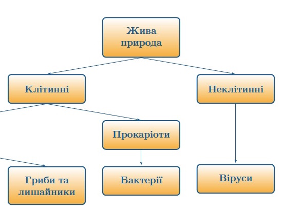

# Cтародавня епоха пізнання Землі
<!-- Core CSS file -->
<link rel="stylesheet" href="path/to/photoswipe.css"> 

<!-- Skin CSS file (styling of UI - buttons, caption, etc.)
     In the folder of skin CSS file there are also:
     - .png and .svg icons sprite, 
     - preloader.gif (for browsers that do not support CSS animations) -->
<link rel="stylesheet" href="path/to/default-skin/default-skin.css"> 

<!-- Core JS file -->
 

<!-- UI JS file -->

Люди у всі часи цікавилися світом, що їх оточує. Тому витоки географії як землеописової науки знаходимо у давніх народів. У різних народів уявлення про землю та досягнення в її пізнанні відрізнялися. Давні єгиптяни вміли визначати напрямок південь - північ, передбачали, якими будуть повені на Нілі. Месопотамці виділяли 12 місяців у році, пояснювали рухи небесних тіл, склали карти земель уздовж річок Тигр і  Євфрат, склали описи країн, що розташовувалися між Середземним морем і Перською затокою. Фінікійці були мореплавцями і першовідкривачами. Вони вміли орієнтуватися за зорями, заснували багато портів у Середземному морі. Є відомості про те, що фінікійці першими плавали вздовж берегів Африки, тоді ще невідомого для європейців материка.
Великий внесок у розвиток географії внесли античні вчені. Так, Анаксімандр винайшов сонячний годинник – гномон, а також першим накреслив географічну карту з використанням масштабу.

