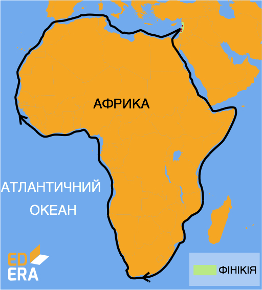

# Cтародавня епоха пізнання Землі

Люди у всі часи цікавилися світом, що їх оточує. Тому витоки географії як землеописової науки знаходимо у давніх народів. У різних народів уявлення про землю та досягнення в її пізнанні відрізнялися. Давні єгиптяни вміли визначати напрямок південь - північ, передбачали, якими будуть повені на Нілі. Месопотамці виділяли 12 місяців у році, пояснювали рухи небесних тіл, склали карти земель уздовж річок Тигр і  Євфрат, склали описи країн, що розташовувалися між Середземним морем і Перською затокою.

<i>Рисунок 1. Уявлення стародавніх індійців про землю.</i>

**Фінікійці** були мореплавцями і першовідкривачами. Вони вміли орієнтуватися за зорями, заснували багато портів у Середземному морі. Є відомості про те, що фінікійці першими плавали вздовж берегів Африки, тоді ще невідомого для європейців материка.
Великий внесок у розвиток географії внесли античні вчені. Так, Анаксімандр винайшов сонячний годинник – гномон, а також першим накреслив географічну карту з використанням масштабу.

Рисунок 3. Маршрут подорожі фінікійців. (600 р. до н.є.)

