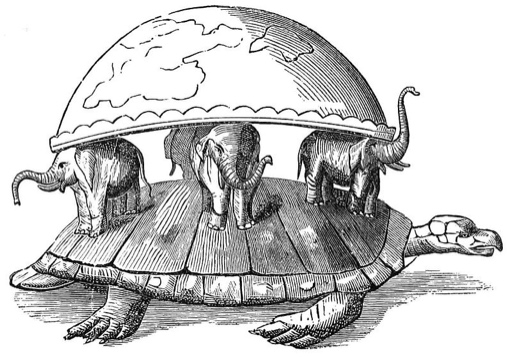
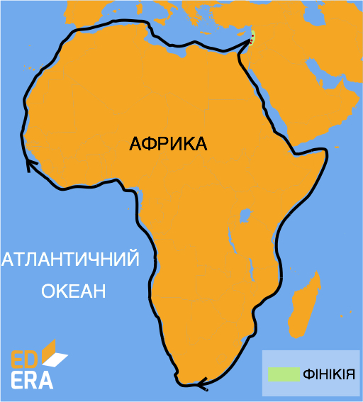
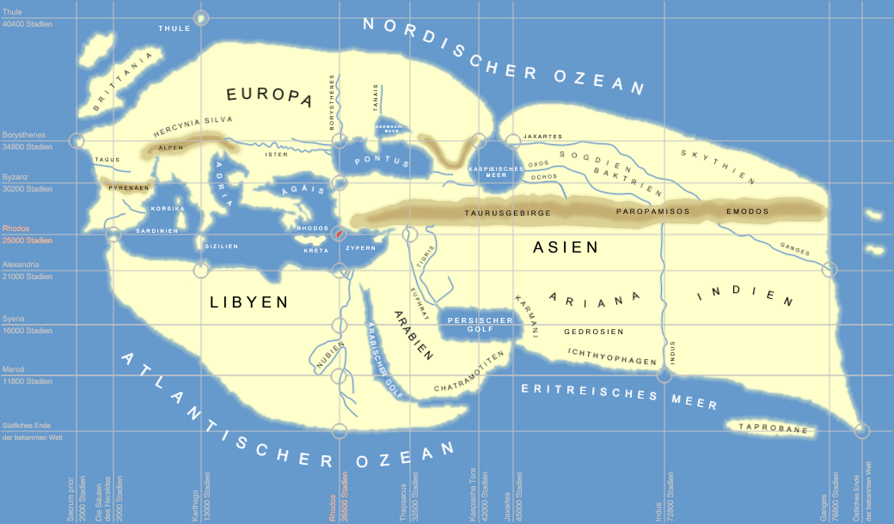
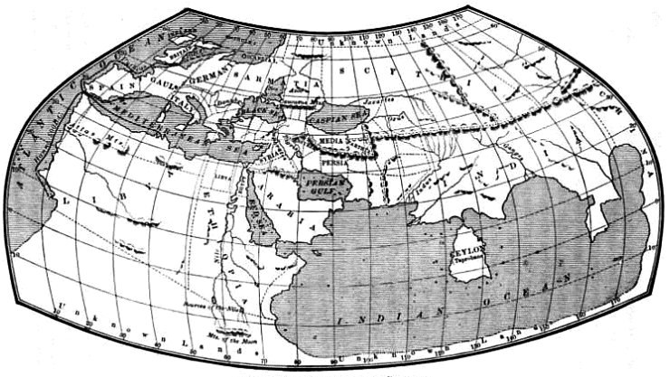

# Cтародавня епоха пізнання Землі

Люди у всі часи цікавилися світом, що їх оточує. Тому витоки географії як землеописової науки знаходимо у давніх народів. У різних народів уявлення про землю та досягнення в її пізнанні відрізнялися. Давні єгиптяни вміли визначати напрямок південь - північ, передбачали, якими будуть повені на Нілі. Месопотамці виділяли 12 місяців у році, пояснювали рухи небесних тіл, склали карти земель уздовж річок Тигр і  Євфрат, склали описи країн, що розташовувалися між Середземним морем і Перською затокою.

<i>Рисунок 1.1:  Уявлення стародавніх індійців про землю</i>

<h3>Фінікійці</h3>

Фінікійці були мореплавцями і першовідкривачами. Вони вміли орієнтуватися за зорями, заснували багато портів у Середземному морі. Є відомості про те, що фінікійці першими плавали вздовж берегів Африки, тоді ще невідомого для європейців материка.

Великий внесок у розвиток географії внесли античні вчені. Так, <p1>Анаксімандр</p1> винайшов сонячний годинник – <i>гномон</i>, а також першим накреслив географічну карту з використанням масштабу.

<i>Рисунок 1.2: Маршрут подорожі фінікійців (600 р. до н.є.)</i>

<h3>Геродот</h3>

Давньогрецький мислитель Геродот відомий своїми описами Скіфії (нині південь України, Північне Причорномор’я), земель біля Каспійського моря, Північної Африки та описами життя і традицій народів, що населяли ці території. Геродот хотів розповісти історію невдалого походу <p1>Дарія</p1> на скіфів  про те, як армія непереможного правителя зазнала поразки в степах України від cкіфів, а затягнулась книга на опис всього їх побуту та звичаїв.  Це перший опис Скіфії та народів, що її населяли, який дійшов до нас. Характерно, що немає доказів того, що Геродот побував у кримських і приазовських містах, тому, ймовірно, книга писалась з розповідей інших колоністів. Геродот описав Скіфію, як величезну безлісу рівнину з родючими ґрунтами, на яких ростуть зернові рослини, цибуля, часник, льон; місцевість із суворими природними умовами: «...зима триває 8 місяців, а повітря наповнюється пір’ям (снігом)». Стверджував, що Земля лежить на овальній площині, на яку спирається небосхил. До речі, «Історія» Геродота посідає 28 рядок у Рейтингу 100 найкращих книг усіх часів журналу <i>Newsweek</i>.

<h3>Ератосфен</h3>

«Батьком географії» заслужено називають Ератосфена. <i>Він першим назвав науку про Землю «географією», обчислив коло Землі, визначив її розміри, виділив п ’ять зон - жарку, дві помірні й дві холодні - та описав їхні межі</i>. Ератосфен склав карту світу, розширивши його межі від Греції до островів Цейлон та Ісландія.

<i>Рисунок 1.3:  Світ за Ератосфеном</i>

<iframe align="center" width="560" height="315" src="https://www.youtube.com/embed/1THnJoJyPDw" frameborder="0" allowfullscreen></iframe>

<h3>Клавдій Птолемей</h3>

Період античної географії завершується працями Клавдія Птолемея «Альмагест» (де він запевняє, що Земля є центром Всесвіту) та «Порадник з географії» у восьми книгах. До них додавалося 27 карт, одна з яких - <i>загальна карта світу</i>, інші – карти окремих частин світу. На карті світу Птолемей <i>застосував градусну сітку</i>. Птолемеївська геоцентрична система світу, а також математична теорія руху планет навколо нерухомої Землі, була актуальною до 1543 року, коли польський астроном Микола Коперник запропонував альтернативну, геліоцентричну систему. Тобто ця теорія панувала 1500 років.

<i>Рисунок 1.4:  Карта світу з "Географії Птолемея"</i>

<quiz correctLabel="correct" incorrectLabel="incorrect" checkLabel="check">
<question text="">

Хто з вчених перший визначив розміри Землі?

<answer correct>Ератосфен</answer>
<answer>Геродот</answer>
<answer>Птолемей</answer>
</question>
</quiz>
