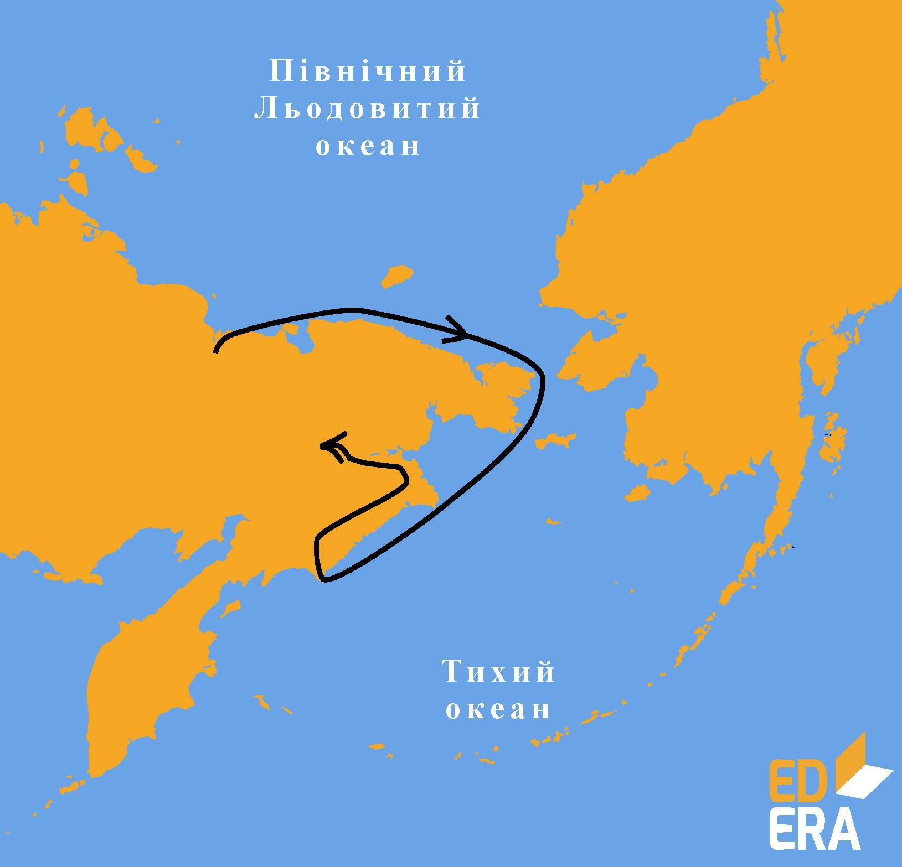

# Дослідження Північно-Східної Азії

Назви Азія і Сибір для європейців тривалий час були невідомими. Просуванню на схід за Уральські гори перешкоджали Казанське та Астраханське татарські ханства. Тільки після завоювання їх російські землепрохідці змогли дістатися берегів Північного Льодовитого і Тихого океанів. Так, 1581 року <p1>Єрмак</p1> перетнув <i>Урал</i>. Це сприяло подальшому швидкому просуванню європейців на <i>схід Євразії</i>.
 

З 1630 року розпочалися походи <p1>козаків-землепрохідців Івана Москвітіна, Василя Пояркова, Єрофея Хабарова</p1>. Вони вийшли на узбережжя Охотського моря та до річки Амур.
 

У 1648 році Федір Попов і Семен Дежньов (<i>відкрив мис Дежньова</i>) уперше пропливли <i>Беринговою протокою</i>. Завдяки цій експедиції на картах з’явилося зображення Північно-Східної Азії, підтверджено існування протоки між Азією і Америкою, відкрито Чукотський півострів.

<i>Рисунок 2.3.6:  Подорож Семена Дежньова</i>

