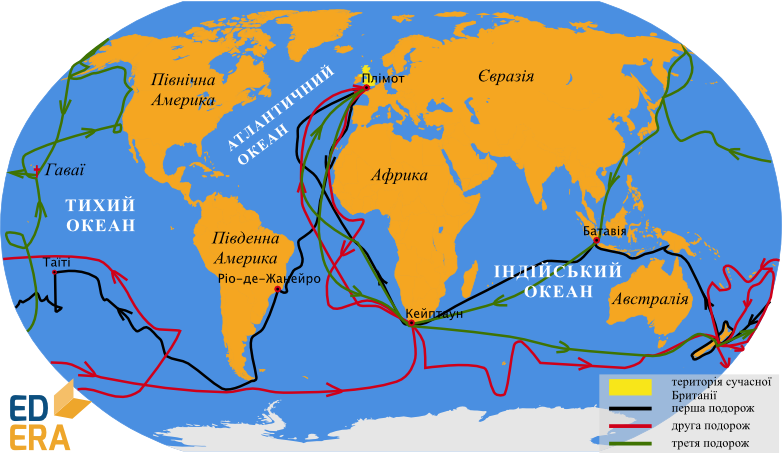

# Джеймс Кук

Метою навколосвітніх подорожей Нового часу було розширення торгівельних зв’язків і колонізація нових земель.
Видатний мореплавець і дослідник того часу англієць Джеймс Кук здійснив три навколосвітні подорожі.

<i>Рисунок 2.4.1:  Маршрут плавання Джеймса Кука</i>

Під час першої (1768-1771) він відкрив східне узбережжя Австралії (до того часу голландці приховували своє відкриття від європейців, тому саме Кук розпочав її колонізацію) і встановив, що Нова Зеландія складається з двох островів. Під час другої експедиції (1772-1775) Джеймс Кук відкрив низку островів у Тихому океані. Під час третьої експедиції (1776-1780) кораблі Джеймса Кука обігнули Австралію, а звідти повернули на північ – до Гавайських островів і далі – до Північного Льодовитого океану. Зіткнувшись з кригою, мореплавець повернув назад до Гавайських островів. Це була його остання подорож. У 1779 році Джеймс Кук загинув у сутичці з місцевим населенням. Цікаво, що Кук заперечував існування антарктичного материка.