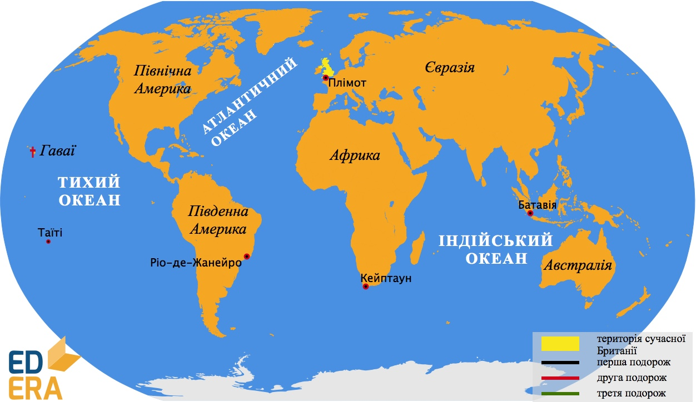

# Епоха Великих географічних відкриттів

Епохою Великих географічних відкриттів заведено називати історичний період від кінця XV до середини ХVII ст.

<h3>Бартоломеу Діаш</h3>

Значних успіхів у відкритті нових земель досягли португальці. Так, принц Португалії Генріх Мореплавець фінансував подорожі вздовж західного узбережжя Африки (<i>його називають Мореплавцем, хоч сам він не брав участі у подорожах</i>). Португалець Бартоломеу Діаш 1487 року вирушив у плавання з метою відкрити морський шлях до Індії. Він обігнув Африку з півдня і побував на її крайній південній точці - мисі Бур, який пізніше назвали <i>мисом Доброї Надії</i>, адже вона давала надію на те, що шлях до Індії буде знайдено.

<i>Рисунок 2.3.1: Маршрут подорожi Бартоломео Дiаша</i>

<h3>Васко да Гама</h3>

На основі звітів Діаша Васко да Гама розробив маршрут свого <i>плавання до Індії</i>. Ця подорож розпочалася 1497 року і тривала понад два роки. Із 170 осіб команди додому повернулося тільки 44. Васко да Гама досягнув жаданих берегів Індії, хоча плавання було дуже складним.

<i>Рисунок 2.3.2: Маршрут подорожi Васко да Гами</i>

<iframe align="center" width="560" height="315" src="https://www.youtube.com/embed/bmxMc1RuMJk" frameborder="0" allowfullscreen></iframe>

<h3>Христофор Колумб</h3>

Одне з найвизначніших відкриттів в історії зробив Христофор Колумб. Спочатку він запропонував португальському королю <i>маршрут західного шляху до Індії</i>. Через великий ризик його спочатку не прийняли. Але пізніше іспанська королева Ізабелла підтримала цю пропозицію. Влітку 1492 року у складі трьох каравел - «<i>Санта-Марія</i>», «<i>Нінья</i>» і «<i>Пінта</i>» - експедиція вирушила на пошуки нового шляху до казково багатої Індії. Колумб вважав відкриті землі Індією, але то не була очікувана казкова земля. Видатний мореплавець здійснив <b>чотири</b> подорожі до берегів <i>Америки</i>. Він відкрив <i>Багамські острови, острови Куба та Гаїті, Малі Антильські острови, острів Трінідад</i>. До самої смерті Колумб був переконаний у тому, що відкрив шлях до Індії.
 

<i>Рисунок 2.3.3: Подорожi Христофора Колумба</i>

<h3>Амеріґо Веспуччі</h3>

У 1502-1504 роках експедиція під керівництвом португальця Амеріґо Веспуччі вирушила до Південної Америки. Вона обстежила східне узбережжя материка. Саме тоді стало зрозумілим, що Колумб і Веспуччі відкрили нові континенти, які назвали <i>Новим Світом</i>.

Цікаво

Ще до Колумба, приблизно у ІХ-ХІ сторіччі до берегів Америки мандрували нормани, більш відомі як вікінги. Це народ, який колись жив на Скандинавському півострові.

<h3>Фернан Магеллан</h3>

<p2>Перша подорож навколо світу</p2>, яку здійснив Фернан Магеллан, розпочалася 1519 року. П’ять суден з командою з 265 осіб успішно перетнули Атлантичний океан. У жовтні 1520 року експедиція увійшла у вузьку протоку (<i>пізніше названу Магеллановою</i>), якою довго блукала в пошуках проходу до невідомого тоді океану. Під час цих пошуків було відкрито архіпелаг <i>Вогняна Земля</i>. Нарешті Магеллан знайшов вихід в океан, який назвав <b>Тихим</b> (<i>за три місяці плавання на ньому не було жодного шторму</i>). Діставшись Філіппінських островів, Магеллан зіткнувся з вороже налаштованими місцевими мешканцями та загинув в одній із сутичок з ними. Залишки експедиції з 18 осіб на судні «<i>Вікторія</i>» на чолі з Хуаном Елькано обігнули Африку і 6 вересня  1522 року повернулися до Іспанії.
 

<i>Отже, подорож Магеллана довела, що Земля кулястої форми, підтвердила єдність Світового океану та відкриття нового материка Колумбом</i>.

<i>Рисунок 2.3.4: Навколосвiтня подорож Магеллана</i>

<h3>Абель Тасман</h3>

З метою пошуку таємничого Південного материка голландський мореплавець Абель Тасман у 1642-1643 роках очолив експедицію, що з півдня обійшла материк, який пізніше було названо <i>Австралією</i>. Також Тасман відкрив великий острів біля узбережжя материка, пізніше названий його ім’ям – <i>Тасманія</i>. Тасман пройшов також уздовж берегів <i>Нової Зеландії, островів Тонга, Фіджі</i> та ін. У 1644 році мореплавець обстежив північне узбережжя <i>Австралії</i> і наніс його на карту.

<i>Рисунок 2.3.5: Подорож Абеля Тасмана</i>

<h3>Дослідження Північно-Східної Азії</h3>

Назви Азія і Сибір для європейців тривалий час були невідомими. Просуванню на схід за Уральські гори перешкоджали Казанське та Астраханське татарські ханства. Тільки після завоювання їх російські землепрохідці змогли дістатися берегів Північного Льодовитого і Тихого океанів. Так, 1581 року <p1>Єрмак</p1> перетнув <i>Урал</i>. Це сприяло подальшому швидкому просуванню європейців на <i>схід Євразії</i>. З 1630 року розпочалися походи <p1>козаків-землепрохідців Івана Москвітіна, Василя Пояркова, Єрофея Хабарова</p1>. Вони вийшли на узбережжя Охотського моря та до річки Амур. У 1648 році Федір Попов і Семен Дежньов (<i>відкрив мис Дежньова</i>) уперше пропливли <i>Беринговою протокою</i>. Завдяки цій експедиції на картах з’явилося зображення Північно-Східної Азії, підтверджено існування протоки між Азією і Америкою, відкрито Чукотський півострів.

<i>Рисунок 2.3.6:  Подорож Семена Дежньова</i>

<h3>Френсіс Дрейк</h3>

Географічні відкриття здійснювали навіть пірати. Одним з піратів був Френсіс Дрейк. У 1577-1580 роках він здійснив <p2>другу навколосвітню подорож</p2>. Дрейк довів, що <i>Вогняна Земля</i> - острів, наніс західне узбережжя Північної Америки на карту. За заслуги у відкриттях королева Великобританії присвоїла йому шляхетне звання лицаря. Хоча він вважався героєм серед англійців, серед іспанців вважався злочинцем і піратом, відомим під прізвиськом <p2>El Draque</p2>, тобто «Дракон», адже він посприяв перемозі над Іспанською Армадою у 1588 році. Його настільки незлюбили іспанці, що король Філіп II навіть призначив за його голову нагороду у 20 тис. дукатів.

<i>Рисунок 2.3.7: Маршрут подорожi Френсiса Дрейка</i>

Запам’ятайте

Навколосвітня подорож Френсіса Дрейка починається з Великобританії, а Магеллана – з Іспанії.

Табл. 2.3.1: Мандрiвки середньовiччя

<table>
<tr>
<td align="center" width="35%">Вiкiнги 
(IX-XV ст.)</td>
<td align="center" width="35%">Марко Поло 
(1254-1324 рр.)</td>
<td align="center" width="35%">Афанасiй Нiкiтiн 
(?-1475 р.)</td>
</tr>
<tr style="height:100px">
<td valign="top">
<ul>
<li>Вiдкрили та заселили Iсландiю.</li>
<li>Досягли берегiв Ґренландiї та Пiвнiчної Америки.</li>
<li>Склали описання Бiлого моря та Скандинавського пiвострова.</li>
<li>Склали оповiдання про мiста та князiв Київськiй Русi.</li>
</ul>
</td>
<td valign="top">
<ul>
<li>Провiв 17 рокiв, мандруючи країнамi Сходу, вивчав Китай, збирав вiдомостi про Iндiю та Китай.</li>
<li>Пiсля повернення до Європи записав свої враження, якi ввiйшли в iсторiю як «Книга Марка Поло».</li>
<li>Написав книгу «Ходiння за три моря», яка мiстить цiннi лiтературно-iсторичнi та географiчнi матерiали.</li>
</ul>
</td>
<td valign="top">
<ul>
<li>Був мандрiвником, росiйським купцем, побував у Персiї, Iндiї, Сомалi, Iранi, Османськiй iмперiї, Криму; перетнув Каспiйське, Аравiйське та Чорне моря.</li>
</ul>
</td>
</tr>
</table>

Табл. 2.3.2: Епоха великих географiчних видкриттiв

<table>
<tr>
<td width="15%">1487 р.</td>
<td width="35%">Португалець Бартоломеу Дiаш обiгнув Африку з пiвдня.</td>
<td width="50%">Пiдтвердилися сподiвання, що Iндiї можна дiстатися океаном, прямуючи вздовж схiдного Узбережжя Африки.</td>
</tr>
<tr>
<td width="15%">1492 р.</td>
<td width="35%">Ґенуезець Христофор Колумб досяг островiв Вест-Iндiї.</td>
<td width="50%">Фактично це було вiдкриття європейцями Америки та початок масштабного освоєння її земель.</td>
</tr>
<tr>
<td width="15%">1492— 1493 рр.</td>
<td width="35%">Перше плавання X. Колумба.</td>
<td width="50%">Експедицiя пройшла вздовж островiв Куба й Еспаньйола.</td>
</tr>
<tr>
<td width="15%">1493— 1496 рр.</td>
<td width="35%">Друге плавання X. Колумба.</td>
<td width="50%">Було вiдкрито багато островiв: Гваделупа, Монтсеррат, Сан Крiстобаль,  Вiрґiнськi, Пуерто-Рiко та iн.</td>
</tr>
<tr>
<td width="15%">1497 р.</td>
<td width="35%">Португалець Васко да Ґама вiдкрив морський шлях iз Європи в Iндiю.</td>
<td width="50%">Вiд того часу i до вiдкриття Суецького каналу (1869 р.) основна торгiвля європейцiв iз країнами Пiвденної та Схiдної Азiї вiдбувалася цим шляхом.</td>
</tr>
<tr>
<td width="15%">1498— 1500 рр.</td>
<td width="35%">Друге плавання X. Колумба.</td>
<td width="50%">Колумб висадився на берег Пiвденної Америки.</td>
</tr>
<tr>
<td width="15%">1502— 1504 рр.</td>
<td width="35%">Третє плавання X. Колумба.</td>
<td width="50%">Протока, яка б вiдкрила шлях до Iндiї, так i не була знайдена.</td>
</tr>
<tr>
<td width="15%">1519— 1522 рр.</td>
<td width="35%">Перше навколосвiтнє плавання iспанської експедицiї пiд керiвництвом Фернана
Маґеллана.</td>
<td width="50%">На практицi було доведено, що Земля має форму кулi, а Свiтовий океан є єдиним цiлим.</td>
</tr>
<tr>
<td width="15%">1577— 1580 рр.</td>
<td width="35%">Друге навколосвiтнє плавання ескадри пiратiв, що мали заступництво англiйської
корони, пiд керiвництвом Френсiса Дрейка.</td>
<td width="50%">Були зробленi важливi уточнення карти свiту.</td>
</tr>
<tr>
<td width="15%">Кiнець XVI— середина XVII ст.</td>
<td width="35%">Походи землепроходцiв iз метою освоєння Сибiру та Далекого Сходу.</td>
<td width="50%">Була дослiджена значна частина Сибiру та Далекого Сходу, складенi карти.</td>
</tr>
<tr>
<td width="15%">1644 р.</td>
<td width="35%">Вiдкриття Австралiї голландським мореплавцем Абелем Тасманом.</td>
<td width="50%">Було остаточно доведено, що Австралiя — самостiйний материк.</td>
</tr>
</table>

  	
  	
  	
  	

<ul>
	<li><input type="checkbox" id="map1" name="check" />
		<label for="squaredThree">asdasd dsa das d</label>
	</li>
	<li><input type="checkbox" id="map2" name="check" />
		<label for="squaredThree">asdasd dsa das d</label>
	</li>
	<li><input type="checkbox" id="map3" name="check" />
		<label for="squaredThree">asdasd dsa das d</label>
	</li>
</ul>
<button class="btn show-label show-map">Переглянути маршрути</button>
 

<quiz correctLabel="correct" incorrectLabel="incorrect" checkLabel="check">
<question text="">

Укажiть iм’я мандрiвника, який здiйснив першу навколосвiтню подорож

<answer>Христофор Колумб</answer>
<answer correct>Фернан Магеллан</answer>
<answer>Васко да Гама</answer>
<answer>Iбн Батута</answer>
</question>
<question text="">

Укажiть iм’я мандрiвника, якого називали "залiзним пiратом"

<answer>Хуан Елькано</answer>
<answer>Амерiго Веспуччi</answer>
<answer>Христофор Колумб</answer>
<answer correct>Френсiс Дрейк</answer>
</question>
</quiz>