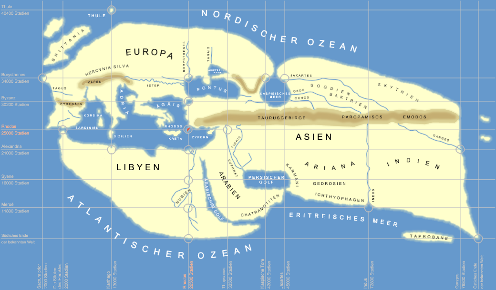

# Ератосфен

«Батьком географії» заслужено називають Ератосфена. <i>Він першим назвав науку про Землю «географією», обчислив коло Землі, визначив її розміри, виділив п ’ять зон – жарку, дві помірні й дві холодні – та описав їхні межі</i>. Ератосфен склав карту світу, розширивши його межі від Греції до островів Цейлон та Ісландія.

<i>Рисунок 2.1.3:  Світ за Ератосфеном</i>

<iframe align="center" width="560" height="315" src="https://www.youtube.com/embed/1THnJoJyPDw" frameborder="0" allowfullscreen></iframe>

