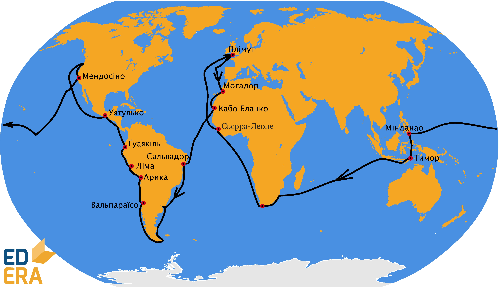

# Френсіс Дрейк

Географічні відкриття здійснювали навіть пірати. Одним з піратів був Френсіс Дрейк. У 1577-1580 роках він здійснив <p2>другу навколосвітню подорож</p2>. 

<i>Рисунок 2.3.7: Маршрут подорожi Френсiса Дрейка</i>

Дрейк довів, що <i>Вогняна Земля</i> - острів, наніс західне узбережжя Північної Америки на карту. За заслуги у відкриттях королева Великобританії присвоїла йому шляхетне звання лицаря. Хоча він вважався героєм серед англійців, серед іспанців вважався злочинцем і піратом, відомим під прізвиськом <p2>El Draque</p2>, тобто «Дракон», адже він посприяв перемозі над Іспанською Армадою у 1588 році. Його настільки незлюбили іспанці, що король Філіп II навіть призначив за його голову нагороду у 20 тис. дукатів.

Запам’ятайте

Навколосвітня подорож Френсіса Дрейка починається з Великобританії, а Магеллана – з Іспанії.

