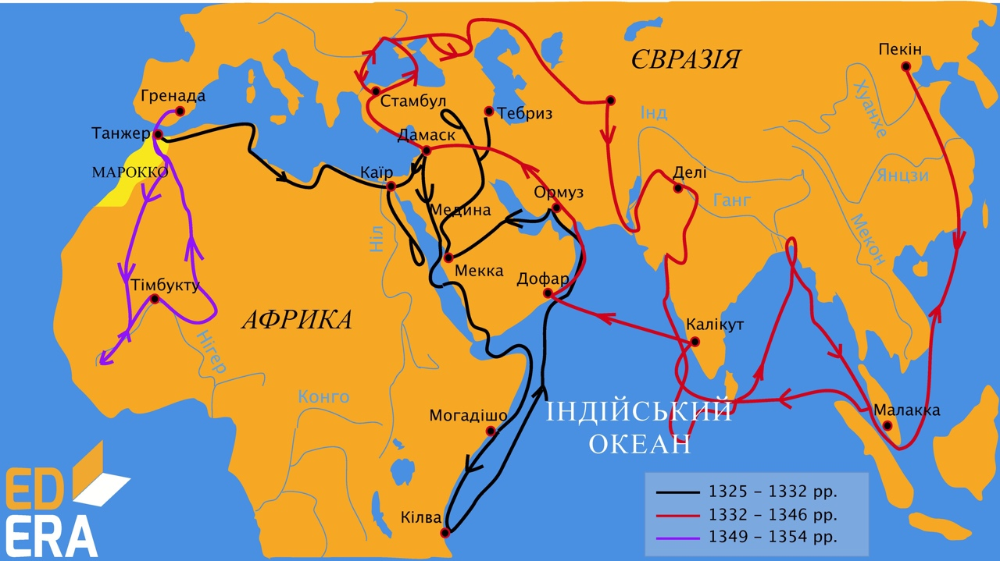

# Ібн Батута

Одним із найвидатніших мандрівників того часу був Ібн Батута, який, подорожуючи протягом понад 30 років, подолав відстань близько 120 тисяч кілометрів. Він дійшов майже до екватора і довів, що жарка приекваторіальна земля заселена.
 

<i>Рисунок 2.2.1:  Маршрут подорожi Iбн Батути</i>

Запам’ятайте

Подорож Ібн Батути почалася з Марокко, а дійшов він аж до Китаю. Зі слів Ібн Батути була написана книга «Подарунок споглядачам про дива міст та чудеса подорожей», яка є цінним історичним джерелом, адже в ній описано найцікавіше, що бачив Батута за довгі роки подорожей.

