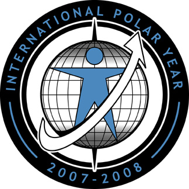
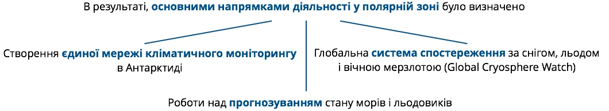
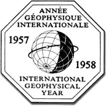

# Міжнародні дослідження земної кулі

Важливими для вивчення землі були Міжнародні полярні роки (МПР), коли було проведено міжнародні дослідження полярних областей Землі. Таких років було чотири: 1882-83 роки (Перший МПР), 1932-33 роки (Другий МПР), 1957-58 роки (Третій МПР), 2007-2009 роки (Четвертий МПР). 

<i>Рисунок 2.6.1: «Логотип МПР»</i>

За часи Першого МПР було видано 36 томів наукових робіт, однак на той час велику кількість технічних розробок ще належало зробити (не було навіть радіо), станцій було мало, не вистачало наукових кадрів, тож ці дослідження були не особливо продуктивними та велися здебільшого у геофізичній, метеорологічній, біологічній сфері. 

Другий МПР вже був більш серйозним, дослідження велися на 58 станціях, використовувалися передові на той час технічні пристрої. Проводилися навіть радіозондові, радіофізичні та акустичні дослідження атмосфери. Третій МПР відбувався у рамках міжнародного геофізичного року. В його проведенні брали участь 67 країн.

У цей рік відбулося встановлення баз в Антарктиді та ряд експедицій в глибину континенту, встановлення плавучих обсерваторій на крижинах в Арктиці. 

Під час Четвертого МПР було проведено більше 800 проектів, які були націлені на визначення сучасного стану навколишнього середовища в полярних регіонах. Дослідники намагалися:

* порівняти зміни навколишнього середовища та стану народонаселення в полярних регіонах в минулому і майбутньому; 
* розробити **прогноз майбутніх змін**; 
* поліпшити розуміння взаємодії між полярними регіонами та іншою частиною планети в усіх масштабах;
* використати унікальне положення полярних регіонів і **створити обсерваторії** з вивчення процесів, що відбуваються всередині Землі, на Сонці і в космосі; 
* вивчити культурні, історичні та соціальні процеси, що формують стійкість життя малих північних народів і визначити їх внесок у різноманітність загальнолюдської культури.

У другій половині XX ст. з ініціативи Міжнародного географічного союзу проводять глобальні вивчення Землі. Першого липня 1957 року було  започатковано науковий проект, названий «Міжнародним геофізичним роком». Дослідження виявилися такими грандіозними, що оголошений рік розтягнувся аж на 18 місяців. За єдиною програмою вели спостереження і дослідження земної кори, атмосфери, океанів. Міжнародна програма з вивчення річок, озер, боліт та інших водних об’єктів завершилася «Міжнародним десятиріччям» (1965-1974). 

У 1948 році було засновано Міжнародний союз охорони природи (МСОП), метою якого була розрока Всесвітньої стратегії охорони природи. 

<i>Рисунок 2.6.1: «Офіційна емблема Міжнародного геофізичного року»</i>

