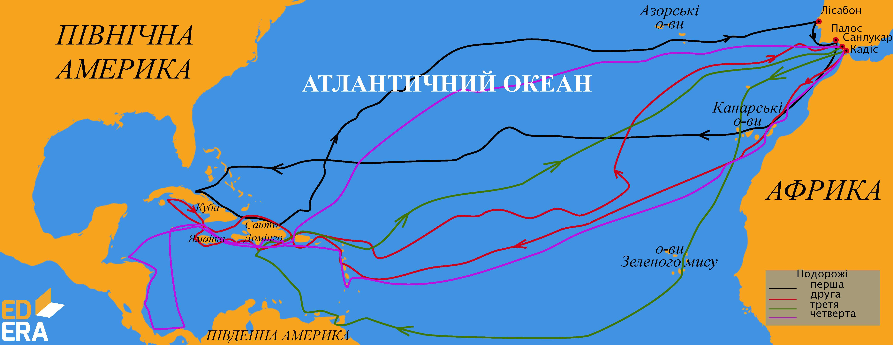

# Христофор Колумб

Одне з найвизначніших відкриттів в історії зробив Христофор Колумб. Спочатку він запропонував португальському королю <i>маршрут західного шляху до Індії</i>. Через великий ризик його спочатку не прийняли. Але пізніше іспанська королева Ізабелла підтримала цю пропозицію. Влітку 1492 року у складі трьох каравел – «<i>Санта-Марія</i>», «<i>Нінья</i>» і «<i>Пінта</i>» – експедиція вирушила на пошуки нового шляху до казково багатої Індії. Колумб вважав відкриті землі Індією, але то не була очікувана казкова земля. Видатний мореплавець здійснив <b>чотири</b> подорожі до берегів <i>Америки</i>. Він відкрив <i>Багамські острови, острови Куба та Гаїті, Малі Антильські острови, острів Трінідад</i>. До самої смерті Колумб був переконаний у тому, що відкрив шлях до Індії.
 

<i>Рисунок 2.3.3: Подорожi Христофора Колумба</i>

