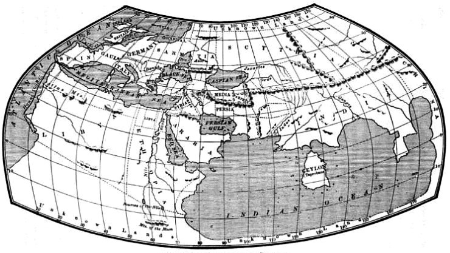

# Клавдій Птолемей

Період античної географії завершується працями Клавдія Птолемея «Альмагест» (де він запевняє, що Земля є центром Всесвіту) та «Порадник з географії» у восьми книгах. До них додавалося 27 карт, одна з яких – <i>загальна карта світу</i>, інші – карти окремих частин світу.

<i>Рисунок 2.1.4:  Карта світу з "Географії Птолемея"</i>

На карті світу Птолемей <i>застосував градусну сітку</i>. Птолемеївська геоцентрична система світу, а також математична теорія руху планет навколо нерухомої Землі, була актуальною до 1543 року, коли польський астроном Микола Коперник запропонував альтернативну, геліоцентричну систему. Тобто ця теорія панувала 1500 років.
