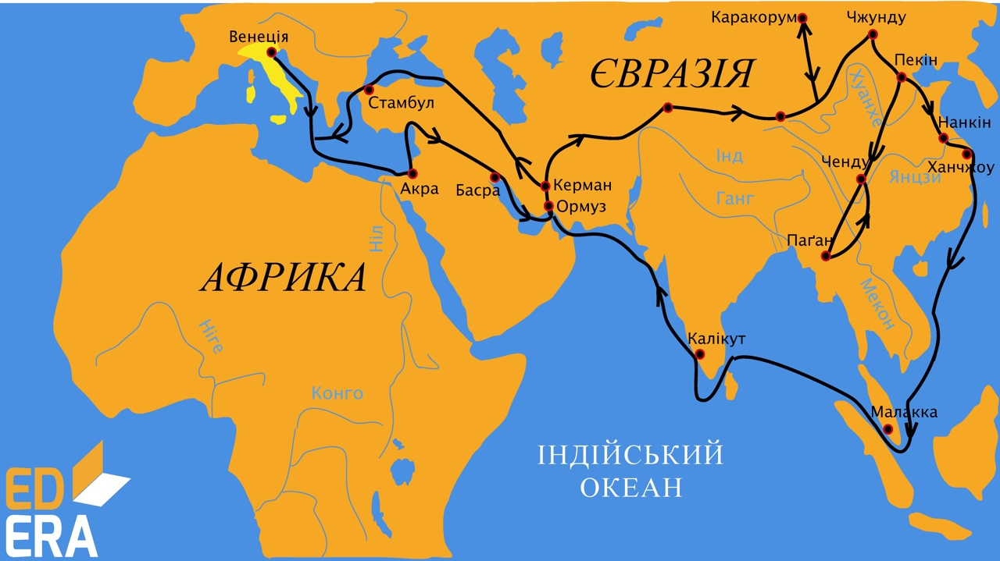

# Марко Поло

Марко Поло – перший європеєць, який відвідав Китай та внутрішні райони Азії. Подорож відбулася у 1271–1295 роках. 

<i>Рисунок 2.2.2: Маршрут подорожі Марко Поло</i>

Цей венеціанський купець почав подорожувати ще у 17 років. У 1297 році Марко Поло був ув’язнений у Генуезькій фортеці. Тут, у полоні, він продиктував одному з в’язнів свою «Книгу». В ній Марко Поло докладно описав Китай, Персію, Вірменію, Грузію, Індію, згадав про Японію, Мадагаскар і підтвердив, що південніше від екватора є поселення людей. Але оригінал цього манускрипту, на жаль, не зберігся. Книга його багато разів перевидавалася і доповнювалась. Вона мала значний вплив на мореплавців, картографів, письменників XIV–XVI століть. Зокрема вона була на кораблі Христофора Колумба під час його пошуку маршруту в Індію.
