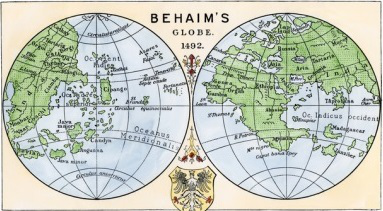

# Мартін Бехайм

Бурхливий розвиток географії у Європі розпочався за часів Відродження (з початку XV ст). Європейці почали активно відкривати нові землі. Великобританія, Голландія, Іспанія і Португалія – були на той час найрозвиненішими морськими державами та наполегливо змагалися між собою за володіння морськими просторами та заморськими країнами. Відкриття нових земель дало поштовх для розвитку картографії та країнознавства. Німецький географ і мандрівник Мартін Бехайм виготовив <i>перший із відомих нам глобусів</i> – «Земне яблуко». На ньому досить точно зображено океани і суходіл. За основу для глобуса Бехайм узяв карту світу Птолемея.

<i>Рисунок 2.2.3: Півкулі глобуса Бехайма</i>

