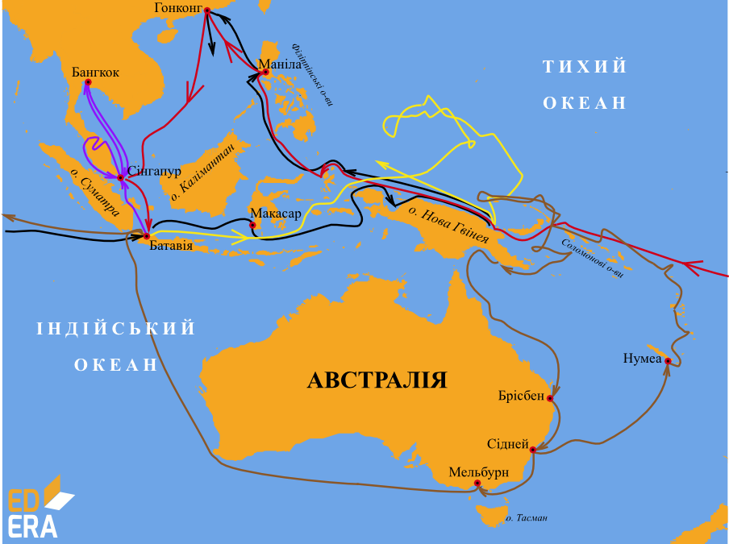

# Микола Миклухо-Маклай

Не можна не сказати про дослідження нашого земляка Миколи Миклухо-Маклая. Він дванадцять років жив серед  папуасів Нової Гвінеї. Вивчав життя та побут жителів островів Індонезії та Мікронезії, досліджував узбережжя Австралії.

<iframe align="center" width="560" height="315" src="https://www.youtube.com/embed/gUIMizdkMzc" frameborder="0" allowfullscreen></iframe>

Тим, хто зацікавився життям цьєї видатної людини, радимо переглянути фільм "Берег його життя".

<i>Рисунок 2.4.4:  Подорожі Миклухо-Маклая</i>

Запам’ятайте

Головним досягненням Миклухо-Маклая, оціненим сучасниками, стало практичне доведення видової єдності людства.

