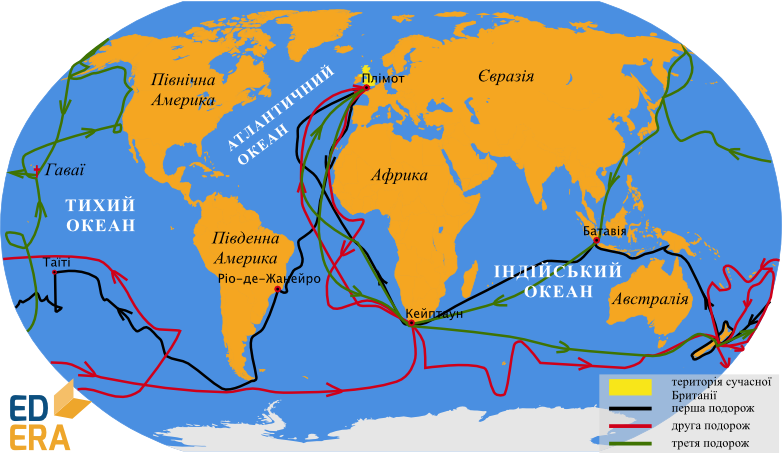
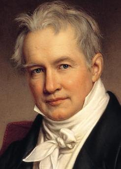
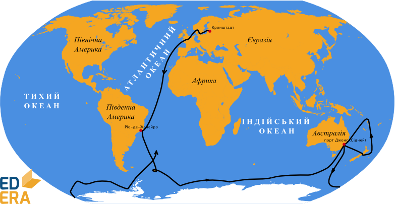
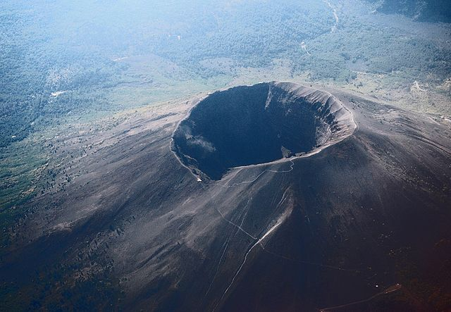
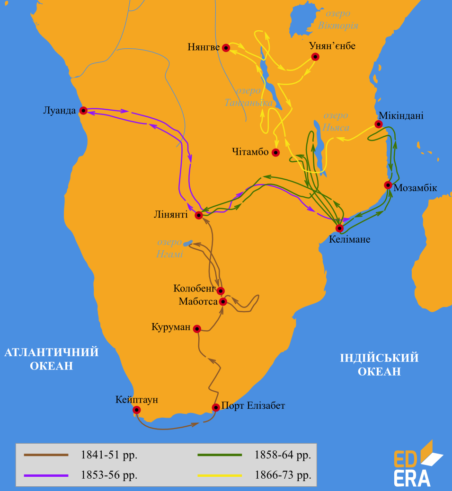

#Географія нового часу

 Упродовж другої половини XVIII й всього XIX ст. всебічно вивчали внутрішні території всіх відомих на той час земель, досліджували території навколо полюсів Землі, відкрили льодовий континент – Антарктиду. Сміливі й мужні мореплавці, вирушаючи у тривалі навколосвітні подорожі, ретельно вивчали особливості Світового океану та суходолу, складали докладні карти своїх мандрівок. Цей час увійшов в історію пізнання земної кулі як Новий час.
 
 

<h3>Вітус Беринг</h3>
Нову сторінку в морські дослідження вписали експедиції, організовані за ініціативи російського царя Петра І. Так, у 1725-1730 роках Перша камчатська експедиція під керівництвом Вітуса Беринга остаточно підтвердила наявність протоки між Азією та Америкою. Завдяки Великій Північній експедиції (1733-1743) на карту було нанесено північні райони Сибіру, доведено неможливість регулярного плавання водами Північного Льодовитого океану через суцільну кригу. 

<iframe align="center" width="560" height="315" src="https://www.youtube.com/embed/6erqAr9r-2c" frameborder="0" allowfullscreen></iframe>

<h3>Джеймс Кук</h3>
Метою навколосвітніх подорожей Нового часу було розширення торгівельних зв’язків і колонізація нових земель.
Видатний мореплавець і дослідник того часу англієць Джеймс Кук здійснив три навколосвітні подорожі.

<i>Рисунок 2.4.1:  Маршрут плавання Джеймса Кука</i>

Під час першої (1768-1771) він відкрив східне узбережжя Австралії (до того часу голландці приховували своє відкриття від європейців, тому саме Кук розпочав її колонізацію) і встановив, що Нова Зеландія складається з двох островів. Під час другої експедиції (1772-1775) Джеймс Кук відкрив низку островів у Тихому океані. Під час третьої експедиції (1776-1780) кораблі Джеймса Кука обігнули Австралію, а звідти повернули на північ – до Гавайських островів і далі – до Північного Льодовитого океану. Зіткнувшись з кригою, мореплавець повернув назад до Гавайських островів. Це була його остання подорож. У 1779 році Джеймс Кук загинув у сутичці з місцевим населенням. Цікаво, що Кук заперечував існування антарктичного материка.

<h3>Александр Гумбольдт</h3>
Важливими були експедиції в Азії, подорож Александра Гумбольдта до Південної Америки, дослідження Александра Маккензі Північно-Західної Канади та інші. 

Александр Гумбольдт (1769-1859) – німецький натураліст, географ і мандрівник. За фахом Гумбольдт був гірничим інженером, займався ботанікою, мінералогією, хімією, також виконував обов'язки камергера і радника прусського короля, читав лекції в Берлінському університеті.  Подорожував по Європі, Центральній і Південній Америці, Росії – Уралу, Алтаю, прикаспійських територіям і Каспійському морю.
Написав багато визначальних наукових книг, серед яких такі роботи:

* 30-томний твір «Подорож в рівноденні області Нового Світу» в 1799-1804 (включали описи рослин, геодезичні та картографічні матеріали, дані із зоології, порівняльної анатомії тощо). 
*	«Картини природи» (за результатами американської експедиції). Вперше були сформульовані ідеї про тісний зв'язок між кліматом і характером рослинності. 
*	«Космос» – план опису фізичного світу, де Гумбольдт спробував узагальнити всі були в той час знання про Всесвіт і Землю.
*	Незакінченими залишилися п'ять томів Історії географії. 

Своїм основним завданням він вважав «осягнення природи як цілого і збір свідчень про взаємодію природних сил». Гумбольдт створив такі наукові дисципліни, як фізична географія, ландшафтознавство, географія рослин. Розробив метод ізотерм, склав карту їх розподілу і фактично дав обгрунтування кліматології як науки. Докладно описав континентальний і приморський клімат, встановив природу їх відмінностей. Гумбольдт першим звернув увагу на небезпеку великомасштабної вирубки лісів. Завдяки його дослідженням були закладені наукові основи геомагнетизму. 

На початку XIX ст. було організовано кілька навколосвітніх подорожей. Одну з них очолили Іван Крузенштерн та Юрій Лисянський на суднах «Надежда» та «Нева». Під час цієї експедиції (1803-1806) було уточнено карту світу, відкрито низку островів, проведено численні дослідження в океані. Дуже цікавими були описи побуту, традицій, господарства жителів Сахаліну і Камчатки. Крузенштерн склав «Атлас Південного моря», найточніший на той час.

<h3>Фадей Беллінсгаузен і Михайло Лазарєв</h3>
Унікальною стала експедиція Фадея Беллінсгаузена і Михайла Лазарєва, яка вирушила в дорогу 1819 року на двох кораблях – «Восток» і «Мирний», аби знайти материк на крайньому півдні Землі. Подолавши труднощі плавання під вітрилами майже в суцільній кризі, 28 січня 1820 року кораблі підійшли до невідомого материка. Так був відкритий шостий материк – Антарктида. Крім материка, мореплавці побачили чимало островів. Вони визначили місце розташування своїх стоянок і провели різноманітні спостереження, зокрема за станом криги. Нині Антарктида – це материк міжнародного співробітництва, на якому є й українська наукова станція «Академік Вернадський».

<i>Рисунок 2.4.2:  Маршрут плавання Беллінсгаузена і Лазарєва</i>

<h3>Микола Миклухо-Маклай</h3>
Не можна не сказати про дослідження нашого земляка Миколи Миклухо-Маклая. Він дванадцять років жив серед  папуасів Нової Гвінеї. Вивчав життя та побут жителів островів Індонезії та Мікронезії, досліджував узбережжя Австралії.

<iframe align="center" width="560" height="315" src="https://www.youtube.com/embed/gUIMizdkMzc" frameborder="0" allowfullscreen></iframe>

Тим, хто зацікавився життям цьєї видатної людини, радимо переглянути фільм "Берег його життя".

<i>Рисунок 2.4.3:  Подорожі Миклухо-Маклая</i>

Запам’ятайте

Головним досягненням Миклухо-Маклая, оціненим сучасниками, стало практичне доведення видової єдності людства.

<h3>Петро Семенов-Тянь-Шанський</h3>
Великою є заслуга Петра Семенова-Тянь-Шанського. Досліджував Центральне Чорнозем'я, подорожував по Швейцарії. Сімнадцять разів підіймався на Везувій. Очолював експедицію на Тянь-Шань (1856-1857). Створив школу російської географії, працював над установленням взаємозв'язків та взаємодії природних компонентів. Широко застосовував метод порівняння. Був організатором першого Всеросійського перепису населення 1898 року. Керував багатотомним виданням «Росія. Повний географічний опис нашої батьківщини» та «Мальовнича Росія» (1881-1885).

<i>Рисунок 2.4.4:  Активний вулкан Везувій, південь Італії</i>

<h3>Девід Лівінгстон</h3>
Видатним дослідником Африки був Девід  Лівінгстон. У 1840 р. він вирушив як проповідник християнської релігії в Південну Африку.  В 1849 році він пройшов через пустелю Калахарі до озера Нгамі, де ще ніколи не бували європейці. Наступного року він досяг верхів’їв великої річки Замбезі.  В 1852 році Лівінгстон разом з багатьма туземцями – провідниками розпочав велику подорож на 33 човнах вверх по р. Замбезі. Саме тоді вперше в історії він перетнув материк зі сходу на захід, від р. Замбезі до Луанди. Коли раз Лівінгстон спускався вниз за течією Замбезі, перед ним постав величезний водоспад. Відкритому водоспаду мандрівник дав назву Вікторія, на честь англійської королеви. Він усе своє життя досліджував Африку та зробив найбільший внесок у вивчення цього материка.

<i>Рисунок 2.4.5: Дослідження Девіда Лівінгстона</i>

<quiz correctLabel="correct" incorrectLabel="incorrect" checkLabel="check">
<question text="">

На честь кого названо протоку між Азією та Америкою?

<answer>Френсіс Дрейк</answer>
<answer correct>Вітус Беринг</answer>
<answer>Семен Дєжньов</answer>
<answer>Iбн Батута</answer>
</question>
<question text="">

Хто розпочав колонізацію Австралії?

<answer>Абель Тасман</answer>
<answer correct>Джеймс Кук</answer>
<answer>Семен Дєжньов</answer>
<answer>Микола Миклухо-Маклай</answer>
</question>
</quiz>