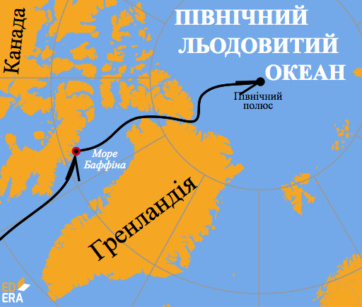
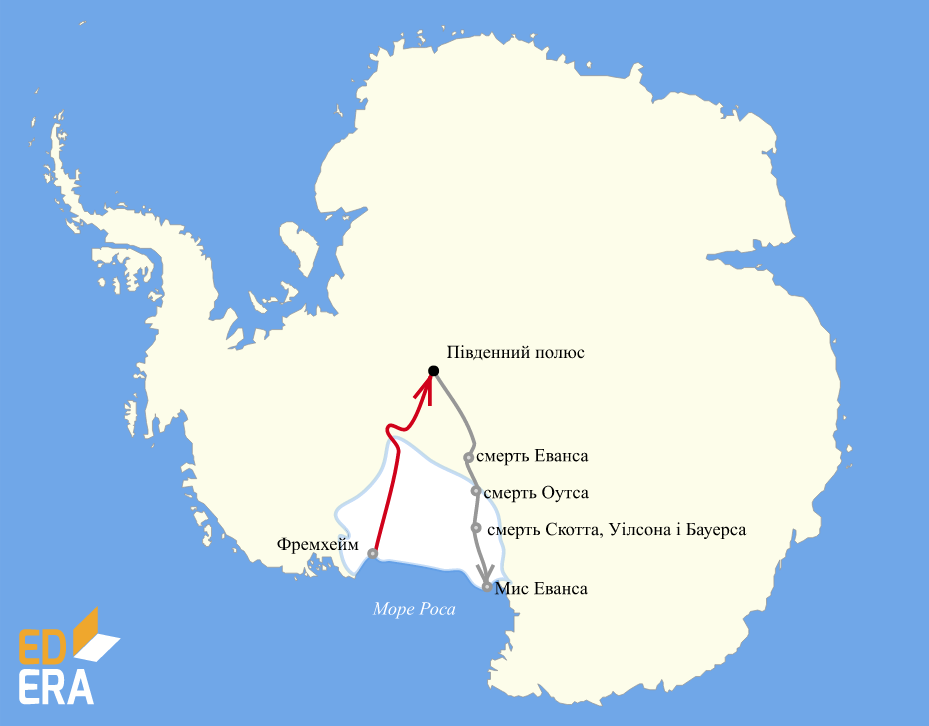

# Освоєння полярних широт

<iframe align="center" width="560" height="315" src="https://www.youtube.com/embed/h1J26o8B-Sw" frameborder="0" allowfullscreen></iframe>

У XX ст. було організовано експедиції до полюсів Землі. Так, 6 квітня 1909 року, американський полярний мандрівник Роберт Пірі з п’ятьма своїми супутниками досяг Північного географічного полюса. Ім’ям Роберта Пірі названо один з півостровів Гренландії.

<i>Рисунок 2.5.1:  Подорож Роберта Пірі</i>

У 1910-1912 роках норвежець Руаль Амундсен на судні «Фрам» здійснив подорож до Антарктиди. Південного полюса він дістався 14 грудня 1911 року. У той самий час до Антарктиди вирушив англієць Роберт Скотт на судні «Терра-Нова». Однак Південного полюса він досяг майже на місяць пізніше за Р. Амундсена. Останки його експедиції було знайдено лише наступного літа. Мандрівники загинули у 20 км від найближчого табору з продовольством.

 

<i>Рисунок 2.5.2:  Маршрути експедицій Амундсена та Скотта</i>

Табл. 2.5.1: Дослідження південних широт

<table>
<tr style="height:100px">
<td valign="top">
Перша російська антарктична експедиція під керівництвом Фадея Беллінсгаузена і Михайла Лазарєва відкрила материк Антарктиду (1820 р.)
</td>

<td valign="top">
Норвезький дослідник Руаль Амундсен і його супутники 14 грудня 1911 р. досягли Південного полюса
</td>
<td valign="top">
Експедиція англійця Роберта Скотта 18 січня 1912 р. дісталася Північного полюса, але на зворотному шляху всі учасники експедиції загинули
</td>
</tr>
</table>

Табл. 2.5.2: Дослідження північних широт

<table>
<tr style="height:100px">
<td valign="top">
Експедиція Віллема Баренца досліджувала моря <i>Північно-льодовитого океану</i> (1596—1597 рр.)
</td>

<td valign="top">
Вітус Беринґ склав карти <i>північного узбережжя Аляски</i> (1728 р.)
</td>

<td valign="top">
Англієць  Едвард Паррі (1827 р.) та італієць Умберто Кальї(1900 р.) зробили невдалі спроби дістатися <i>Північного полюса</i>
</td>

<td valign="top">
Американський морський офіцер Роберт Пірі першим дістався <i>Північного полюса</i>
</td>

<td valign="top">
Фрітьоф Нансен спробував дістатися Північного полюса на кораблі «Фрам», але експедиція вимушена була повернутися
</td>
</tr>
</table>

<quiz correctLabel="correct" incorrectLabel="incorrect" checkLabel="check">
<question>

У якому році була відкрита Антарктида?

<answer correct>1820</answer>
<answer>1909</answer>
<answer>1911</answer>
<explanation>
Відкрила Перша російська антарктична експедиція під керівництвом Фадея Беллінсгаузена і Михайла Лазарєва у 1820 році.
</explanation>
</question>
<question>

Який з полюсів Землі був відвіданий людьми першим?

<answer correct>Північний</answer>
<answer>Південний</answer>
<explanation>
Північного полюсу досяг Роберт Пірі 6 квітня 1909 року, а Південного полюса дістався Руаль Амундсен 14 грудня 1911 року.
</explanation>
</question>

</quiz>

