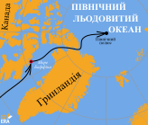

# Освоєння полярних широт

<iframe align="center" width="560" height="315" src="https://www.youtube.com/embed/h1J26o8B-Sw" frameborder="0" allowfullscreen></iframe>

У XX ст. було організовано експедиції до полюсів Землі. Так, 6 квітня 1909 року, американський полярний мандрівник Роберт Пірі з п’ятьма своїми супутниками досяг Північного географічного полюса. Ім’ям Роберта Пірі названо один з півостровів Гренландії.

<i>Рисунок 1.18:  Подорож Роберта Пірі</i>

 У 1910-1912 роках норвежець Руаль Амундсен на судні «Фрам» здійснив подорож до Антарктиди. Південного полюса він дістався 14 грудня 1911 року. У той самий час до Антарктиди вирушив англієць Роберт Скотт на судні «Терра-Нова». Однак Південного полюса він досяг майже на місяць пізніше за Р. Амундсена. Останки його експедиції було знайдено лише наступного літа. Мандрівники загинули у 20 км від найближчого табору з продовольством.
 

<i>Рисунок 1.19:  Маршрути експедицій Амундсена та Скотта</i>

