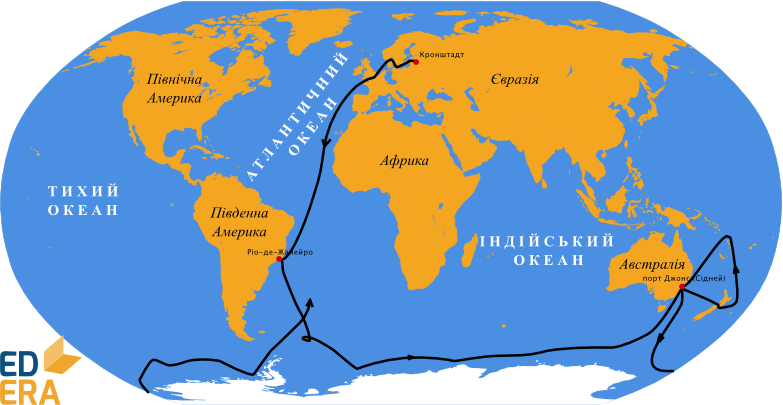

# Фадей Беллінсгаузен і Михайло Лазарєв

Унікальною стала експедиція Фадея Беллінсгаузена і Михайла Лазарєва, яка вирушила в дорогу 1819 року на двох кораблях – «Восток» і «Мирний», аби знайти материк на крайньому півдні Землі. Подолавши труднощі плавання під вітрилами майже в суцільній кризі, 28 січня 1820 року кораблі підійшли до невідомого материка. Так був відкритий шостий материк – Антарктида. Крім материка, мореплавці побачили чимало островів. Вони визначили місце розташування своїх стоянок і провели різноманітні спостереження, зокрема за станом криги. Нині Антарктида – це материк міжнародного співробітництва, на якому є й українська наукова станція «Академік Вернадський».

<i>Рисунок 2.4.3:  Маршрут плавання Беллінсгаузена і Лазарєва</i>

