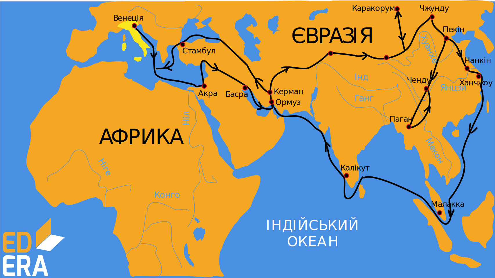

# Пізнання Землі у середні віки

У середні віки (V-ХV ст.) знання про Землю розширили араби. Арабські мандрівники описали вітри та утворення хмар, здійснили поділ Землі на 14 кліматичних районів, створили Атлас клімату, вивчали особливості утворення окремих форм земної поверхні. 

Одним із найвидатніших мандрівників того часу був <p1>Ібн Батута</p1>, який, подорожуючи протягом понад 30 років, подолав відстань близько 120 тисяч кілометрів. Він дійшов майже до екватора і довів, що жарка приекваторіальна земля заселена. 

<i>Рисунок 6. Маршрут подорожi Iбн Батута</i>

Запам’ятайте

Подорож Ібн Батути почалася з Марокко, а дійшов він аж до Китаю. Зі слів Ібн Батути була написана книга «Подарунок споглядачам про дива міст та чудеса подорожей», яка є цінним історичним джерелом, адже в ній описано найцікавіше, що бачив Батута за довгі роки подорожей.

 
Значні географічні досягнення в середні віки належать <p1>ученим Китаю</p1>. Вони перші у світі здійснили <i>перепис населення</i>. Перші почали проводити систематичні спостереження за погодою, створили <i>опадомір, компас</i>, описали <i>колообіг води в природі</i>, пояснили <i>формування річкових долин</i> і <i>процеси руйнування гір</i>. Крім того, китайські мандрівники перетнули Тибет і Гімалаї - найвищі гори світу, проклали морські шляхи на захід і схід.

<p1>Марко Поло</p1> – перший європеєць, який відвідав Китай та внутрішні райони Азії. Була ця подорож у 1271–1295 роках. Цей венеціанський купець почав подорожувати ще у 17 років. У 1297 році Марко Поло був ув’язнений у Генуезькій фортеці. Тут, у полоні, він продиктував одному з в’язнів свою «Книгу». В ній Марко Поло докладно описав Китай, Персію, Вірменію, Грузію, Індію, згадав про Японію, Мадагаскар і підтвердив, що південніше від екватора є поселення людей. Але оригінал цього манускрипту, на жаль, не зберігся. Книга його багато разів перевидавалася і доповнювалась. Вона мала значний вплив на мореплавців, картографів, письменників XIV–XVI століть. Зокрема вона була на кораблі Христофора Колумба під час його пошуку маршруту в Індію.

<i>Рисунок 6. Маршрут подорожі Марко Поло</i>

