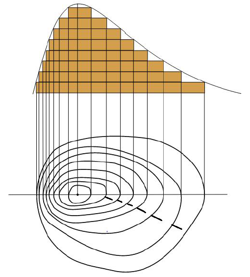

# Абсолютна висота 

Визначення

<b>Абсолютна висота</b> – це висота мiсцевостi, визначена вiд рiвня Балтiйського моря (за початок вiдлiку висот на Землi прийнято рiвень Балтiйського моря (<b>Кронштадтського футштока</b>)).

<i>Рисунок 3.2.1:  Горизонталi та берштрихи</i>

Абсолютна висота точок, розташованих вище від рівня моря, – додатна, а нижче – від’ємна. Так, вище розташовані гори суходолу, нижче – окремі
низовини. 

Наприклад

Абсолютна додатна висота найвищих гір світу Гімалаїв дорівнює 8848 м над рівнем моря, а абсолютна від’ємна висота – це рівень Мертвого моря (-395 м). 

 

На планах і топографічних картах абсолютна висота визначається за горизонталями. Абсолютні висоти вершин горбів або гір показують на планах і картах цифрою з крапкою. На місцевості визначити абсолютну висоту можна за репером – геодезичним знаком, що вказує висоту над рівнем моря даної точки земної поверхні. За планом або топографічною картою її визначають як різницю абсолютних висот двох точок.

<quiz correctLabel="correct" incorrectLabel="incorrect" checkLabel="check"> 
    <question text="">
        
Рівень якого місця на Землі прийнято за початок відліку висот?

        <answer correct>Балтійського моря</answer>
        <answer>Мертвого моря</answer>
        <answer>Чорного моря</answer>
        <answer>Середземного моря</answer>
    </question>
</quiz>
