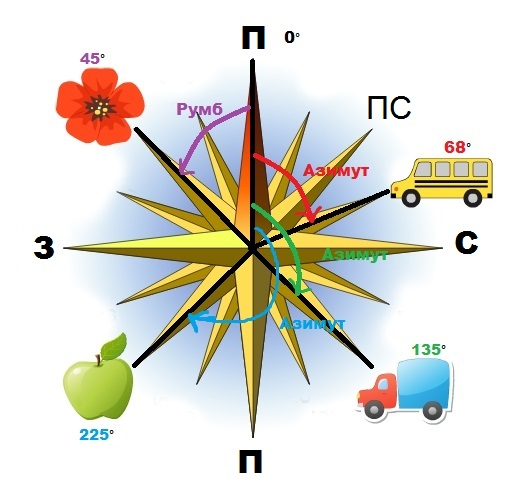

# Азимут

Визначення

<b>Азимут</b> — це горизонтальний кут мiж напрямком на пiвнiч i напрямком на обраний об’єкт.

Кут відраховують тільки за годинниковою стрілкою.

Величина азимута може змінюватися від $$0^{\circ}$$ до
$$360^{\circ}$$.

Визначення

<b>Румб</b> — це кут мiж напрямком на предмет та найближчим кiнцем меридiана.

Меридіани вказують напрямок північ-південь.

<iframe align="center" width="560" height="315" src="https://www.youtube.com/embed/CDPIw5at8BM" frameborder="0" allowfullscreen></iframe>

**Алгоритм визначення азимута за планом**:

1.  Зорієнтувати план за допомогою компаса. Для цього необхідно повернути план таким чином, щоб його напрямок на північ збігся з напрямком, який указує компас.
2.  Установити компас у тій точці плану, звідки потрібно визначити азимут на той або інший предмет.
3.  Зорієнтувати компас за сторонами горизонту.
4.  Визначити азимут за шкалою компаса, повертаючи кільце доки, аж доки уявна лінія не з’єднає проріз, мушку й зображення об’єкта, на який визначається азимут.

<quiz correctLabel="correct" incorrectLabel="incorrect" checkLabel="check"> 
    <question text="">
        
Який напрямок знаходження предмета, якщо його азимут дорівнює 270°?

        <answer>Північ</answer>
        <answer>Південний захід</answer>
        <answer correct>Захід</answer>
        <answer>Схід</answer>
    </question>
    <question text="">
        
Чому дорівнюватиме азимут предмета, який знаходиться у північно-західному напрямку?

        <answer>45°</answer>
        <answer>30°</answer>
        <answer>300°</answer>
        <answer correct>315°</answer>
    </question>
        <question text="">
        
Покажчиком напрямку «Північ — Південь» на глобусі й  карті є:

        <answer correct>меридіан</answer>
        <answer>паралель</answer>
        <answer>екватор</answer>
        <answer>горизонталь</answer>
    </question>
</quiz>