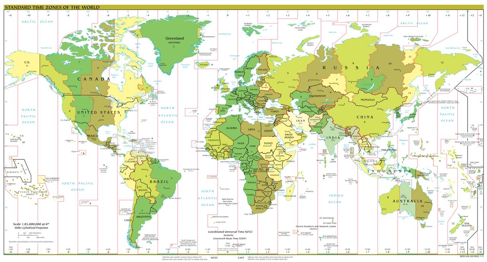
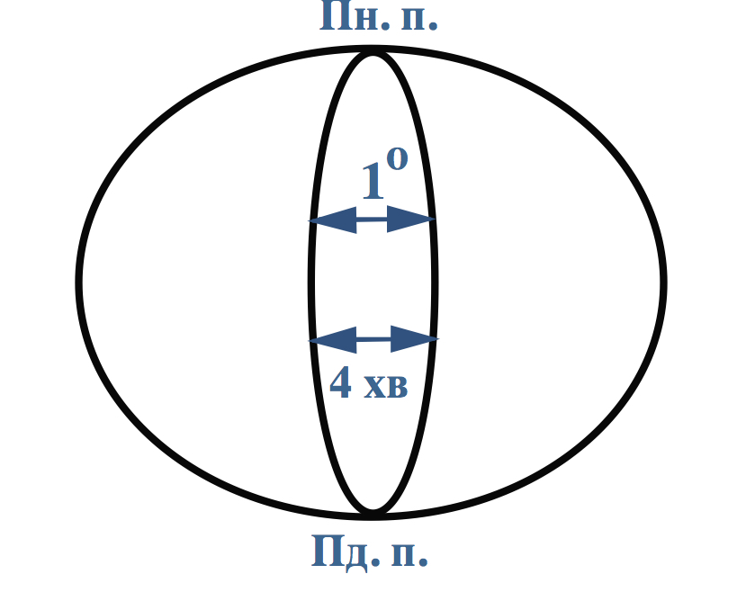
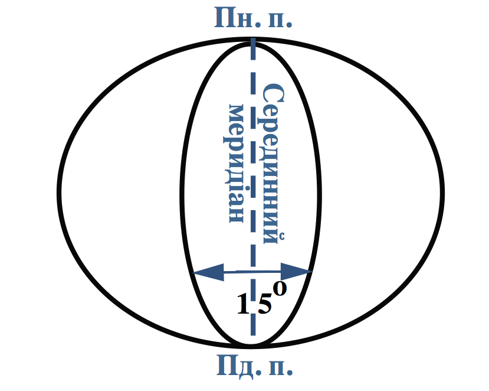

#Часові пояси

<i>Рисунок 4.3.1: Часовi пояси</i>

Автор: TimeZonesBoy

У 1878 р. канадський інженер Сендфорд Флемінґ запропонував систему
міжнародного рахунку часу. За міжнародною домовленістю поверхню Землі
розділено на 24 часові пояси (від 0-го до 23-го) завширшки в середньому
$15^{\circ}$. Відлік цих поясів ведеться у східному напрямку від 0-го
(Ґринвіцького) меридіана. Для зручності межі часових поясів проходять з
урахуванням державних кордонів.

Примітка

<b>Місцевий (сонячний)</b> – час на конкретному меридіані в даний момент.
Він зумовлений розташуванням місцевості на певній довготі. Час між сусідніми меридіанами відрізняється на 4 хвилини.

<b>Поясний</b> – час серединного меридіана в межах одного поясу. Вважається, що Україна розташована у 2-му часовому поясі (Східноєвропейському), хоч її крайній захід належить до 1-го часового поясу, а схід – до 3-го. Серединний меридіан 2-го часового поясу проходить майже через Київ, тому поясний час 2-го поясу називають Київським.

<b>Лінія зміни дат</b> майже збігається зі 180-м меридіаном. Від цієї лінії зі сходу на захід відраховується нова доба.

<table border="0">
  <tr>
    <th>
     
    <i>Рисунок 4.3.2: Місцевий час</i>
    </th>
    <th>
    
    <i>Рисунок 4.3.3: Поясний час</i>
    </th>
  </tr>
</table>

