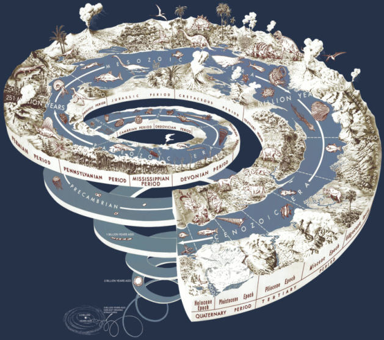

Геологічний час
===============

<i>Рисунок 4.2.1:  Геохронологiчна шкала</i>

Під час історичного розвитку Землі періоди *горотворення* (час, коли
активно формувалися гори) чергувалися з відносно спокійними періодами у
розвитку земної кори. Для зручності всю історію нашої планети вчені
поділили на п’ять великих проміжків часу – **ери**. Кожній з них відповідають
певні періоди горотворення. Ера — це не лише певний етап розвитку
рельєфу нашої планети. Вона містить у собі ще й особливий етап у
формуванні материків і океанів, розвитку життя на Землі. Ери та періоди
складають **геологічний час**. Усі найважливіші події, що відбувалися
протягом цього часу, відображені у так званій геохронологічній шкалі (грецькою «гео» означає
«земля», а «хронос» – «час»).

Найдавнішими ерами є *архейська* (її назва з грецької означає «давня») і
*протерозойська* («раннє життя»), які разом утворюють **докембрій**. Ця
ера охоплює понад 80 % усієї геологічної історії Землі. У докембрії у
складі земної кори переважали базальтові породи. Вже тоді починають
утворюватися окремі підвищені ділянки суходолу з порід, близьких до
гранітних. У той час клімат на Землі був теплим і вологим, з живих
організмів на планеті мешкали лише водорості та бактерії. Інші 20%
історії приходиться на палеозойську («давнє життя»), мезозойську
(«середнє життя») і кайнозойську («нове життя») ери.

<table>
<tr>
<td>Ера (млн рокiв)</td>
<td>Перiоди горотворення</td>
<td>Найважливiшi подiї</td>
</tr>
<tr>
<td><b>Архейська (2700-3800)</b></td>
<td>Архейський (давнi платформи)</td>
<td>Iнтенсивна вулканiчна дiяльнiсть. Поява бактерiй i деяких водоростей</td>
</tr>
<tr>
<td><b>Протерозойська (570-2700)</b></td>
<td>Байкальський (хребти Прибайкалля)</td>
<td>Формування материкової земної кори та давнiх платформ, поява перших гiр на суходолi. Поширення примiтивних морських тварин.</td>
</tr>
<td><b>Палеозойська (185-570)</b></td>
<td>Каледонський (Скандинавськi гори) 
 
Герцинський (Урал, Пiвденнi Аппалачi)</td>
<td>Iснує єдиний материк Пангея, що об’єднує всi сучаснi материки. Посилюються клiматичнi вiдмiнностi мiж екваторiальними i приполярними широтами. Вихiд рослин i тварин на суходiл.</td>
</tr>
<tr>
<td><b>Мезозойська (70-185)</b></td>
<td>Мезозойський (гори Пiвнiчно–Схiдного Сибiру)</td>
<td>Материк Пангея розколюється на кiлька окремих частин, утворюються западини Атлантичного,
Iндiйського океанiв. Розвиток динозаврiв, поява ссавцiв, хвойних рослин.</td>
</tr>
<tr>
<td>
<b>Кайнозойська (70)</b>
</td>
<td>
Альпiйський (Альпи, Карпати)
</td>
<td>
Формуються обриси сучасних материкiв i океанiв. Потужне материкове зледенiння. Панування
квiткових рослин, ссавцiв. Поява людини.
</td>
</tr>
</table>

