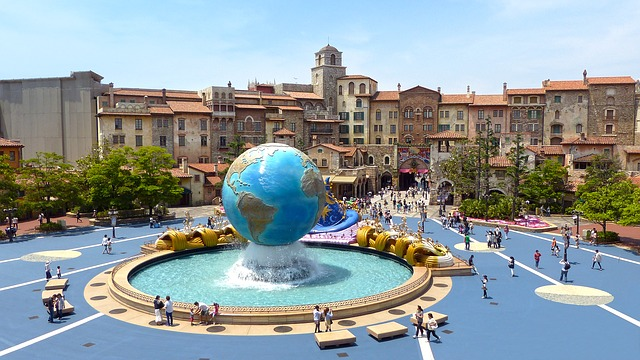

Глобус
------

Означення

<b>Глобус</b> — це об’ємна модель Землi.

За масштабом глобуси поділяють на
<ul>
<li>великі (1 : 30 000 000);</li>
<li>середні (1 : 50 000 000);</li>
<li>малі (1 : 275 000 000).</li>
</ul>

Глобус найбільш реалістично передає
вигляд земної поверхні, адже на ньому немає значних спотворень. Тому пропорції, відстані, кути, площі об’єктів передаються з максимальною
точністю.

<quiz correctLabel="correct" incorrectLabel="incorrect" checkLabel="check"> 
    <question>
        
Яким за величиною є глобус масштабом 1:75 000 000?

        <answer>дрібним</answer>
        <answer correct>малим</answer>
        <answer>середнім</answer>
        <answer>великим</answer>
    </question>
        <question text="">
        
Який з видів зображення Землі забезпечує передачу пропорцій, відстаней, кутів,  площ об’єктів з максимальною точністю

        <answer correct>глобус</answer>
        <answer>карта циліндричної проекції</answer>
        <answer>карта азимутальної проекції</answer>
        <answer>план</answer>
    </question>
</quiz>

