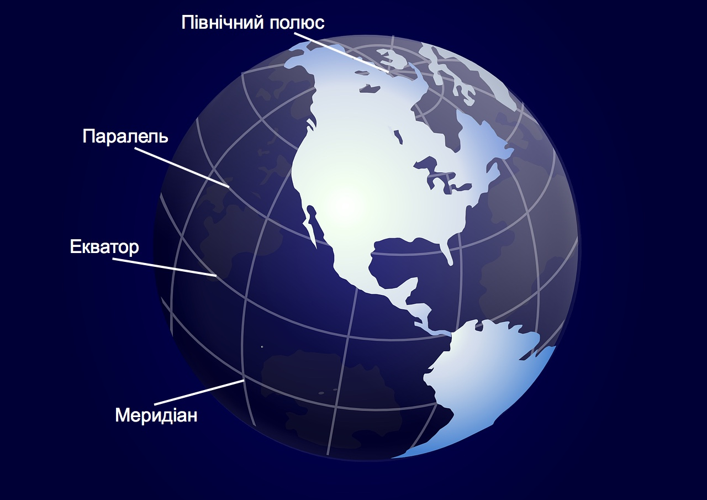
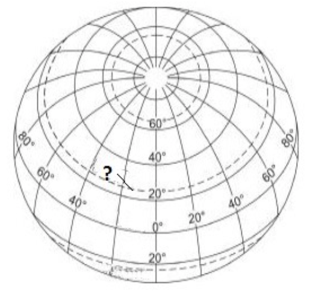

#Градусна сітка Землі. Географічні координати точок

Визначення

<b>Градусна сiтка</b> – система умовних лiнiй (меридiанiв i паралелей) на географiчних картах i глобусах. 
<b>Географiчнi полюси</b> (пiвнiчний i пiвденний) – точки перетину умовної осi обертання Землi iз земною поверхнею.

<i>Рисунок 3.3.1: Градусна сітка</i>

Визначення

<b>Екватор</b> – умовна лiнiя, яка розташована на однаковiй вiдстанi вiд полюсiв i розподiляє земну кулю на двi пiвсфери – Пiвнiчну i Пiвденну. Вiн є найбiльшою паралеллю, довжина якої приблизно $$40000$$ км ($$360^{\circ}$$). Екватор з латинської мови перекладається як «той, що зрiвнює». Ця назва невипадкова, бо екватор – це лiнiя постiйного рiвнодення. 
<b>Меридiани</b> – це лiнiї на глобусi i картi, якi проходять точно вiд Пiвнiчного до Пiвденного полюсiв Землi i вказують напрямок пiвнiч-пiвдень.

На глобусах і картах показують ті меридіани, які відповідають цілому числу градусів, але насправді меридіан можна провести через будь-яку точку на земній кулі. Меридіани відраховують від початкового (нульового) меридіана, тобто Ґринвіцького меридіана. Цей меридіан ділить земну кулю на дві півкулі – Східну і Західну. Довжина кожного меридіана дорівнює приблизно
$$20 000$$ км ($$180^{\circ}$$). Довжина $$1^{\circ}$$ дорівнює $$111,1$$ км.

Визначення

<b>Паралелi</b> — це лiнiї, проведенi на глобусi та картi паралельно до екватора. Паралелi вказують напрямок захiд-схiд.

Відлік починається від екватора до півночі або півдня (можливі значення
широти: від $$0^{\circ}$$ до $$90^{\circ}$$). Довжина всіх паралелей у
градусах $$360^{\circ}$$, а в кілометрах вона різна. Довжина $$1^{\circ}$$
також різна, на екваторі вона дорівнює $$111,1$$ км.

Означення

<b>Географiчнi координати</b> – географiчна широта i географiчна довгота. Вони визначають положення точки на земнiй поверхнi вiдносно екватора i початкового меридiана. 
<b>Географiчна широта</b> – це вiдстань у градусах вiд екватора до точки, координати якої потрiбно визначити. 
<b>Географiчна довгота</b> – це вiдстань у градусах вiд початкового меридiана до точки, координати якої треба визначити.

Географічна широта буває північною (пн. ш.), якщо об’єкт розміщений
північніше екватора, та південною (пд. ш.), коли об’єкт розміщений
південніше екватора. Географічна широта на Землі може змінюватися в
інтервалі від $$0^{\circ}$$ до $$90^{\circ}$$. Усі точки, розміщені на одній
паралелі, мають однакову географічну широту.

Примітка

<b>Екватор</b> – це початок відліку географічної широти, тому його широта становить $$0^{\circ}$$.

Кінцеві точки, до яких можна визначити широту — це Північний та Південний полюси. Їхня географічна широта становить $$90^{\circ}$$ відповідно північної і південної широти.

Географічна довгота може бути східною (сх. д.), якщо об’єкт розміщений на схід від початкового меридіана, і західною (зх. д.), якщо об’єкт розміщений на захід від початкового меридіана. Початковий меридіан (Ґринвіцький) – це початок відліку географічної довготи. Він має довготу
$$0^{\circ}$$. Оскільки вся земна куля має $$360^{\circ}$$, то в кожній з півкуль (Східній чи Західній) довгота може бути в інтервалі від $$0^{\circ}$$ до $$180^{\circ}$$. Усі точки, розміщені на одному меридіані, мають однакову географічну довготу.

<iframe align="center" width="560" height="315" src="https://www.youtube.com/embed/r7B4EX7kFgo" frameborder="0" allowfullscreen></iframe>

<quiz correctLabel="correct" incorrectLabel="incorrect" checkLabel="check"> 
    <question text="">
        
Укажіть назву уявної лінії, що позначена на рисунку знаком питання.

        <answer>Північне полярне коло</answer>
        <answer correct>тропік</answer>
        <answer>екватор</answer>
        <answer>Південне полярне коло</answer>
    </question>
    <question text="">
        
Усі географічні координати будь-яких об’єктів, розташованих на острові Тасманія матимуть:

        <answer correct>південну широту та східну довготу</answer>
        <answer>південну широту та західну довготу</answer>
        <answer>північну широту та східну довготу</answer>
        <answer>північну широту та західну довготу</answer>
    </question>
        <question text="">
        
Усі географічні координати будь-яких об’єктів, що розташовані на острові Гренландія матимуть:

        <answer>північну широту та східну довготу</answer>
        <answer correct>північну широту та західну довготу</answer>
        <answer>південну широту та східну довготу</answer>
        <answer>південну широту та західну довготу</answer>
    </question>
</quiz>
