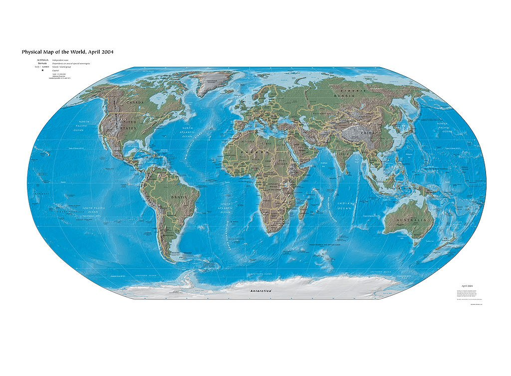
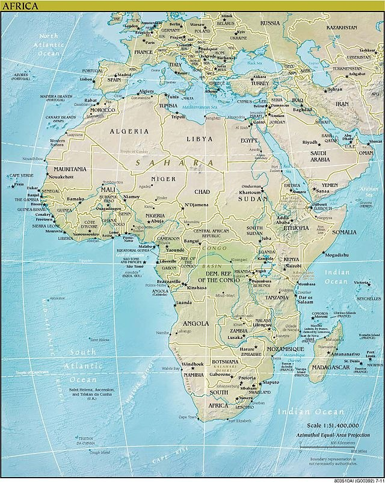
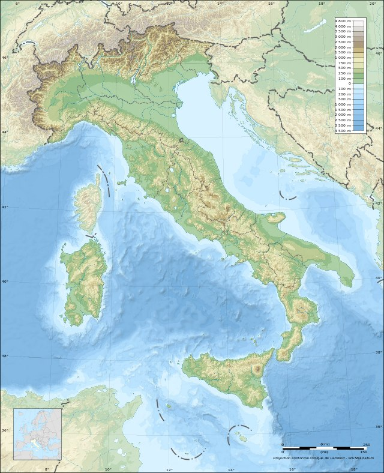

Карта
-----

Означення

<b>Карта</b> – зменшене узагальнене зображення великої дiлянки земної поверхнi на площинi, виконане за допомогою умовних знакiв, в
певнiй проекцiї та масштабi.

Обов’язковою на карті є сітка з ліній, які орієнтують за сторонами
горизонту.

Прикладка

Вертикальні лінії – це меридіани, які вказують напрямок північ–південь.  
Горизонтальні лінії – це паралелі, що вказують напрямок захід–схід.

**Класифікація карт:**

<ol> 
<li>За масштабом:</li>
    <ul>
        <li>великомасштабні (від 1 : 5 000 до 1 : 200 000). 
Загальногеографічні карти такого масштабу називають топографічними;</li> 
        <li>середньомасштабні (від 1 : 200 000 до 1 : 1 000 000). 
Загальногеографічні карти такого масштабу називають оглядово-топографічними;</li> 
        <li>дрібномасштабні (від 1 : 1 000 000 і дрібніше). 
        Загальногеографічні карти такого масштабу називають оглядовими.</li>
    </ul> 
<li>За охопленням території :</li>

<ul><li>світові та півкуль;</li> 

<li>материків, океанів та їх частин;</li> 

<li>держав та їх частин.</li> 

</ul>

<li>  За змістом:</li>

<ul>
    <li>тематичні (топографічна, фізична);</li>
    
    <li>загальногеографічні:</li>
    <ul>
        <li>карти природних явищ (карти рельєфу земної поверхні і дна Світового океану, метеорологічні і кліматичні, грунтові, карти фізико-географічних ландшафтів, геологічні і таке інше);</li>
        <li>карти суспільних явищ (карти населення, економічні, політичні, історичні, соціально-географічні).</li>
    </ul>
</ul>

<li>За призначенням:</li>
<ul>
    <li>навчальні, туристичні, синоптичні, метеорологічні, навігаційні, шляхів сполучення тощо;</li>
</ul>
</ol>

Під час складання карти обов’язково виникають спотворення довжини,
кутів, площі і форми, які є наслідком перенесення кулястої форми Землі
на площину. Існують різні проекції, які мінімалізують конкретні види
спотворень.
