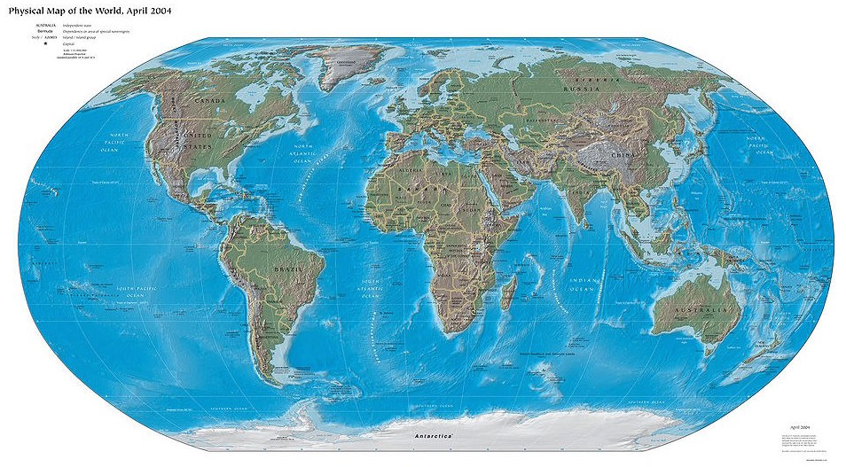

Карта
-----

Означення

Карта – зменшене узагальнене зображення великої дiлянки земної поверхнi на площинi, виконане за допомогою умовних знакiв, в
певнiй проекцiї та масштабi.

Обов’язковою на карті є сітка з ліній, які орієнтують за сторонами
горизонту.

Прикладка

Вертикальні лінії – це меридіани, які вказують напрямок північ–південь.  
Горизонтальні лінії – це паралелі, що вказують напрямок захід–схід.

**Класифікація карт:**

1.  За масштабом:

    -   великомасштабні (від 1 : 5 000 до 1 : 200 000).
        Загальногеографічні карти такого масштабу називають
        топографічними;

    -   середньомасштабні (від 1 : 200 000 до 1 : 1 000 000).
        Загальногеографічні карти такого масштабу називають
        оглядово-топографічними;

    -   дрібномасштабні (від 1 : 1 000 000 і дрібніше).
        Загальногеографічні карти такого масштабу називають оглядовими.

2.  За охопленням території :

-   світові та півкуль;
    

-   материків, океанів та їх частин;

-   держав та їх частин.

3.  За змістом:

    -   тематичні (топографічна, фізична);

    -   загальногеографічні:

        -   карти природних явищ (карти рельєфу земної поверхні і дна Світового океану, метеорологічні і кліматичні, грунтові, карти фізико-географічних ландшафтів, геологічні і таке інше);

        -   карти суспільних явищ (карти населення, економічні, політичні, історичні, соціально-географічні).

4.  За призначенням:

    -   навчальні, туристичні, синоптичні, метеорологічні, навігаційні,
        шляхів сполучення тощо;

Під час складання карти обов’язково виникають спотворення довжини,
кутів, площі і форми, які є наслідком перенесення кулястої форми Землі
на площину. Існують різні проекції, які мінімалізують конкретні види
спотворень.
