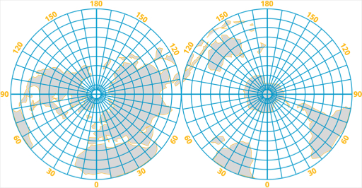
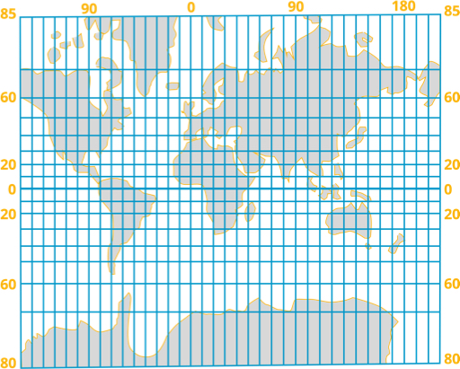
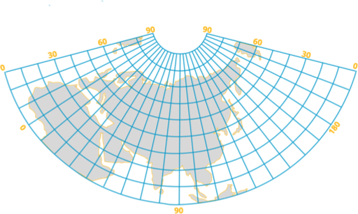

Картографічна проекція
----------------------

За характером спотворень **проекції** поділяють на *рівнокутні*, *рівновеликі* та *довільні*.

* Рівнокутні проекції зберігають без спотворень кути. Кут на
місцевості завжди дорівнює куту на карті, пряма лінія на місцевості –
пряма на карті. Прикладом такої проекції є циліндрична Проекція
Меркатора, яку використовують для морських навігаційних карт.
* У рівновеликих проекціях відсутнє спотворення площ, але при
цьому достатньо сильно спотворюються кути і форми. У такій проекції
зображують економічні, ґрунтові та інші дрібномасштабні карти.
* Довільні проекції спотворюють і кути, і площі, але значно меншою мірою, ніж рівновеликі і рівнокутні проекції, тому їх використовують частіше.

За видом зображення картографічної сітки проекції поділяються на
**азимутальні**, **циліндричні**, **конічні**.

<ul>
<li><b>Азимутальна</b> проекція створюється шляхом проектування місцевості з глобуса на лист, який торкається до глобуса в одній точці. В азимутальних проекціях паралелі зображуються концентричними колами, а меридіани — пучком прямих, що виходять з центру. Застосовують прямі, косі і поперечні азимутальні проекції. Прямі торкаються до полюса, поперечні – до екватора, косі – до будь-якої іншої точки. Меридіани і паралелі в косих і поперечних проекціях зображені кривими лініями, за винятком середнього меридіана, на якому на якому розташована центральна точка проекції. У поперечних проекціях також зображений екватор: він є другою віссю симетрії.
</li>
</ul>

<ul>
<li><b>Циліндрична</b> проекція створюється шляхом проектування місцевості
з глобуса на циліндр. В прямих циліндричних проекціях паралелі і меридіани зображають паралельними прямими лініями, які перпендикулярні між собою. Лінія мінімальних спотворень – лінія дотику допоміжної фігури до Землі. Циліндричні проекції застосовують при складанні карт дрібних і великих масштабів — від загальногеографічних до спеціальних. Так, наприклад, аеронавігаційні маршрутні польотні карти найчастіше скадають в косих і поперечних циліндричних рівнокутних проекціях.
</li>
</ul>

<ul>
<li><b>Конічна</b> проекція створюється шляхом проектування місцевості з глобуса на конус. Лінія мінімальних спотворень буде у помірних широтах.
</li>
</ul>

