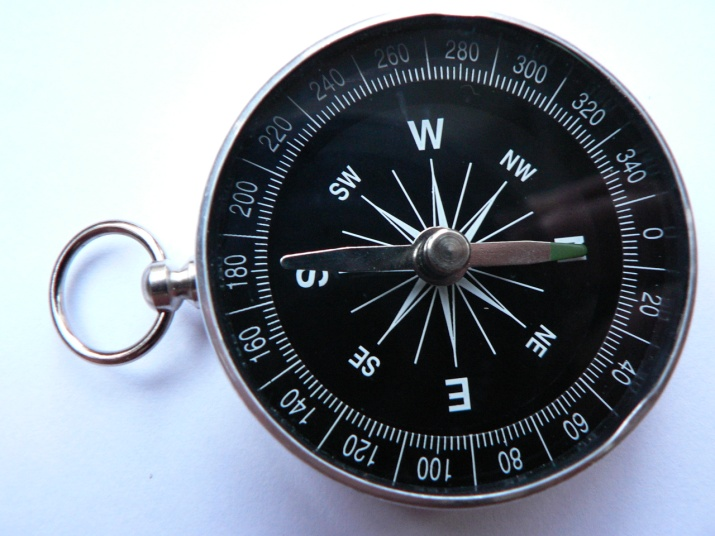

# Орієнтування за компасом

Найчастіше напрямок щодо сторін горизонту визначають за допомогою
компаса. Його намагнічена стрілка завжди одним кінцем показує на
північ, а другим – на південь. Магнітний компас було винайдено в
Китаї. У Середземномор’ї компас з’явився приблизно у ХII ст.

**Послідовність дій для орієнтування за компасом**:

1.  Установити компас на горизонтальну площину.
2.  Вивільнити за допомогою спеціального важеля
    намагнічену стрілку.
3.  Зачекати, доки стрілка заспокоїться.
4.  Повернути корпус компаса, доки позначка N (North – північ) не збіжиться з напрямком, указаним темним кінцем стрілки.

