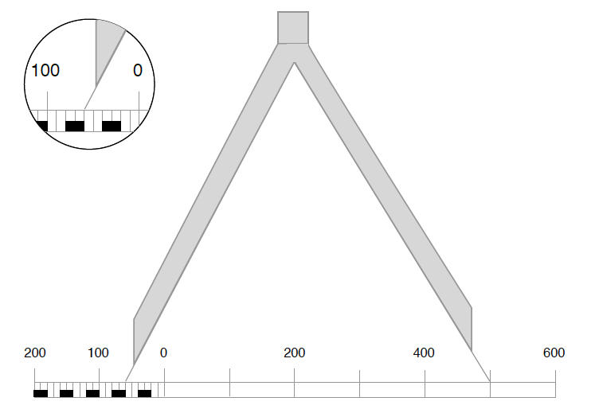

Масштаб
-------

Означення

<b>Масштаб</b> — це дробове число, яке показує, у скiльки разiв зменшено зображення мiсцевостi на картi, планi або глобусi порiвняно з її дiйсними розмiрами на Землi.

Тобто масштаб показує, скільки сантиметрів на місцевості міститься в
одному сантиметрі на карті.

Масштаб поділяється на 

* числовий (1 : 1 000 000);
* іменований (в 1 см – 10 км);
* лінійний (у вигляді лінійки).

Наприклад

Масштаб карти 1 : 300 000. Це означає, що в 1 см на цій
середньомасштабній карті міститься 3 км відстані на місцевості. Чим у меншу кількість разів місцевість зменшено під час зображення її на папері, тим більшим є масштаб зображення, і навпаки.  
Так масштаб 1 : 25 000 буде крупнішим, ніж масштаб 1 : 1 000 000, адже у першому випадку в 1 см – 250 м, а у другому – в 1 см – 10 км. Зрозуміло, що на крупнішому масштабі місцевість буде зображено більш детально.

 

Отже, чим більша цифра у масштабі після одиниці, тим він дрібніший.

Лінійний масштаб використовують для того, щоб уникнути розрахунків.
Циркулем вимірюють на карті відстань між потрібними точками, а потім
прикладають циркуль до масштабу і визначають, якою є дана відстань на
місцевості. Але не завжди на карті є можливість виміряти відстань в
цілих сантиметрах. Для точнішого визначення відстаней один з відрізків
лінійного масштабу (зазвичай крайній лівий) ділять на дрібніші поділки
в 1-2 мм.
