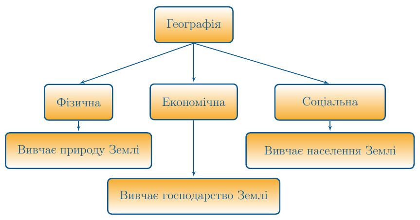

#Географія як наука

Визначення

<b>Географiя</b> — це комплексна наука, яка вивчає природу Землi, компоненти географiчної оболонки, територiальну органiзацiю населення та його господарську дiяльнiсть.

Оскільки *географія – це комплексна наука*, то її поділяють на фізичну, економічну та соціальну.

Фізична географія вивчає природу Землі, економічна – господарство, а соціальна – населення.

Географія має свої методи дослідження, які поділяють на загальногеографiчнi і галузевi. До загальногеографічних методів належать *історичний*, *порівняльний*, *екологічний* та *картографічний*. До галузевих методів – *палеогеографічний* (дає змогу дізнатися про природні умови минулого), *геохімічний* та *геофізичний* (вивчають земну кулю за результатами фізичних і хімічних експериментів) та ін. За об’єктом дослідження в географії розрізняють фізико-географічні методи, що досліджують природу, та економіко-географічні методи, спрямовані на вивчення населення і господарства.

Вивчати географію, отримувати різноманітну інформацію географічного змісту можна за допомогою різних джерел інформації. Ви, як учні, найбільш активно користуєтесь підручниками, географічними картами атласу, словниками та енциклопедіями. Певні географічні знання нам надають засоби масової інформації (ЗМІ) — телебачення, радіо, газети та журнали, світова мережа Інтернет. Важливою у наш час є геоінформаційна система (ГІС) — комп’ютерна система, яка дозволяє поєднати модельне зображення території (електронне відображення карт, схем, космозображень, аерозображень земної поверхні) з інформацією табличного типу (різноманітні статистичні дані, списки, економічні показники тощо).

**Основні джерела географічних знань:**

-   Підручники, географічні карти, словники, енциклопедії

-   Засоби масової інформаії (ЗМІ) – телебачення, радіо, газети та журнали, світова мережа Інтернет

-   Геоінформаційна система (ГІС) – комп’ютерна система, яка дозволяє поєднати модельне зображення території з інформацією табличного типу

<quiz>
<question>

Предметом вивчення якої науки є особливості й закономірності просторової (територіальної) організації суспільства?

<answer>фізичної географії</answer>
<answer correct>соціально-економічної географії</answer>
<answer>картографії</answer>
</question>
<question>

Об’єкт вивчення географії — це:

<answer>населення Землі</answer>
<answer>природа Землі</answer>
<answer correct>географічна оболонка</answer>
<answer>господарська діяльність населення Землі</answer>
</question>
</quiz>
