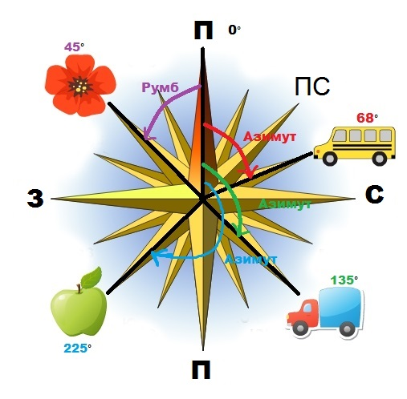

Орієнтування на місцевості
==========================

**Орієнтуватися на місцевості** – вміти визначити своє місцеперебування
відносно сторін горизонту.

Основні сторони горизонту – північ, південь, захід і схід, проміжні – *північний схід, південний схід, південний схід* та *північний захід*.

Визначати сторони горизонту можна по природним об’єктам. Мурашники
майже завжди розташовані з **південного** боку дерева, пня чи куща. У
поодиноких дерев кора з **північного** боку товстіша, часто вкрита
мохом. У ясний день можна орієнтуватися за cонцем.
Опівдні, о 12 год, Сонце знаходиться на **півдні**. Тому тінь від предметів буде направлена на **північ**. Лінію тіні **північ–південь** називають **полуденною лінією**. Надійно орієнтуватися можна за **Полярною зорею**, яка завжди вказує напрямок на **північ** з точністю до $1^{\circ}.$ 

Як запам'ятати

Щоб за напрямком на північ визначити інші, потрібно стати обличчям на північ і розвести руки в боки. По праву руку буде схід, по ліву – захід, а позаду – південь.

**Алгоритм орієнтування за Полярною зорею**:

1.  Bідшукати сузір’я **Великої Ведмедиці** у вигляді «ковша» з семи яскравих зір.

2.  Провести уявну лінію через дві крайні зорі «ковша».

3.  Bідкласти на лінії п’ять разів відстань, яка дорівнює відстані між двома крайніми зорями.

Найчастіше напрямок щодо сторін горизонту визначають за допомогою
компаса. Його намагнічена стрілка завжди одним кінцем показує на
**північ**, а іншим – на **південь**. Магнітний компас було винайдено в
**Китаї**. У Середземномор’ї компас з’явився приблизно у ХII ст.

**Послідовність дій для орієнтування за компасом**:

1.  Установити компас на горизонтальну площину.
2.  Вивільнити за допомогою спеціального важеля
    намагнічену стрілку.
3.  Зачекати, доки стрілка заспокоїться.
4.  Повернути корпус компаса, доки позначка N (North – північ) не збіжиться з напрямком, указаним темним кінцем стрілки.

Означення

<b>Азимут</b> — це горизонтальний кут мiж напрямком на пiвнiч i напрямком на обраний об’єкт.

Кут відраховують тільки за годинниковою стрілкою.

Величина азимута може змінюватися від $0^{\circ}$ до
$360^{\circ}$.

Означення

<b>Румб</b> — це кут мiж напрямком на предмет та найближчим кiнцем меридiана.

Меридіани вказують напрямок північ-південь.

**Алгоритм визначення азимута за планом**:

1.  Зорієнтувати план за допомогою компаса. Для цього необхідно повернути план таким чином, щоб його напрямок на північ збігся з напрямком, який указує компас.
2.  Установити компас у тій точці плану, звідки потрібно визначити азимут на той або інший предмет.
3.  Зорієнтувати компас за сторонами горизонту.
4.  Визначити азимут за шкалою компаса, повертаючи кільце доти, поки уявна лінія не з’єднає проріз, мушку й зображення об’єкта, на який визначається азимут.

