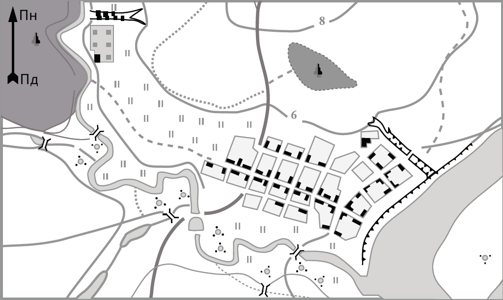

План
----

Означення

<b>План</b> – креслення невеликої дiлянки Землi у певному масштабi, виконане з використанням умовних знакiв (без використання проекцiї, адже проекцiя застосовується для зображення великих дiлянок мiсцевостi через кривизну).

Масштаб плану від 1 : 5000 і крупніший. Плани завжди орієнтовані за
сторонами горизонту. Основні напрямки північ–південь позначають
стрілкою. Спрямована вгору стрілка показує на північ, униз – на південь.
Відповідно, схід буде праворуч, а захід – ліворуч.

<table>
<tr>
<td  align="center" style="width: 50%;">
<b>План</b>
</td>

<td align="center">
<b>Карта</b>
</td>
</tr>
<tr>
<td>
Немає паралелей i меридiанiв
</td>
<td>
Є паралелi й меридiани
</td>
</tr>
<tr>
<td>
Напрямок сторiн горизонту вказано стрiлочкою
</td>
<td>
Напрямок пiвнiч–пiвдень вказують меридiани, захiд–схiд – паралелi
</td>
</tr>
<tr>
<td colspan="2" align="center">
Рiзнi умовнi позначення
</td>
</tr>
<tr>
<td>
Рельєф зображено за допомогою горизонталей
</td>
<td>
Рельєф зображено за допомогою горизонталей i пошарового забарвлення
</td>
</tr>
<tr>
<td>
Бiльш детальне зображення
</td>
<td>
Зображено найбiльш великi й важливi об’єкти (високий ступiнь узагальнення)
</td>
</tr>
</table>

<quiz correctLabel="correct" incorrectLabel="incorrect" checkLabel="check"> 
    <question text="">
        
Який об’єкт позначають наведеним вище умовним знаком?

        <answer>поодиноке дерево</answer>
        <answer>джерело</answer>
        <answer correct>поодинокий кущ</answer>
        <answer>колодязь</answer>
    </question>
    <question text="">
        
Укажіть ознаку, не характерну для карти.

        <answer>виконана у проекції</answer>
        <answer>передає земну поверхню в масштабі</answer>
        <answer correct>напрямок сторін горизонту вказано стрілочкою</answer>
        <answer>використовується в практичній діяльності</answer>
    </question>
        <question multiple>
        
Які три спільні риси плана місцевості й  карти?

        <answer correct>відображують земну поверхню</answer>
        <answer>використовують проекцію</answer>
        <answer correct>використання горизонталей для відображення рельєфу</answer>
        <answer>умовні позначення повністю співпадають</answer>
        <answer correct>виконані в масштабі</answer>
        <answer>використовують градусну сітку</answer>
    </question>
</quiz>
