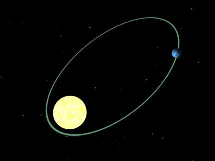
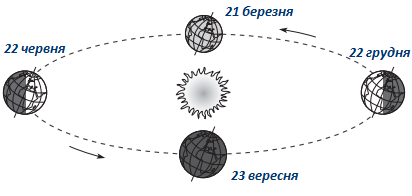

#Рух Землі у космосі

Земля як планета Сонячної системи здійснює 11 видів різних рухів, серед яких два основні *навколо своєї осі* та *навколо Сонця*.

<i>Рисунок 4.2.1: Обертання Землi навколо Сонця</i>

Автор: Talifero

Доба – одиниця часу, за яку Земля здійснює повний оберт навколо своєї осі із заходу на схід. *Тривалість доби — 23 год 56 хв 4 с*.
Обертання навколо своєї осі спричиняє зміну кількості сонячної енергії, яка потрапляє на поверхню Землі протягом доби (зміна дня і ночі), що спричиняє добову зміну температури та є одним з основних факторів формування біоритмів живих істот. Виникнення відхиляючих сил (Коріоліса), під дією яких тіла, що рухаються, в північній частині відхиляються праворуч, а в південній – ліворуч. У північній півкулі сила Коріоліса направлена вправо від руху, тому праві береги річок в Північній півкулі крутіші – їх підмиває вода під дією цієї сили. Сила Коріоліса відповідальна також і за обертання циклонів і антициклонів: у Північній півкулі обертання повітряних мас відбувається в циклонах проти годинникової стрілки, а в антициклонах – за годинниковою стрілкою, у Південному – навпаки. Відхилення вітрів (пасатів) при циркуляції атмосфери – це також прояв сили Коріоліса.

Рік – одиниця часу, за яку Земля здійснює повний оберт навколо Сонця по еліптичній траєкторії. *Рік триває 365 діб 5 год 48 хв 46 с*. Траєкторія руху Землі навколо Сонця не є ідеально круговою, тому кількість сонячної енергії, яка досягає планети, змінюється протягом року, що призводить до явища змін пір року. А разом з особливостями форми Землі та явищем нахилу планети до площини обертання це явище призводить до виникнення широтної поясності (залежність клімату від географічної широти). Також річний рух Землі призводить до зміни полуденної висоти Сонця над горизонтом протягом року.

<i>Рисунок 4.2.2: Рiчний рух землi</i>

Форма землі – геоїд (куля, приплюснута на полюсах). Земна вісь нахилена до площини орбіти під кутом *під кутом $66^{\circ}33'$*. Саме нахил призводить до зміни кількості світла, одержуваного тією чи іншою півкулею протягом року, оскільки одна півкуля планети більше освітлюється, ніж інша. Як наслідок, на більшій частині планети відбувається зміна клімату протягом року. Час, коли одна з півкуль найбільше обернена до Сонця, називається сонцестоянням. Протягом одного обертання планети навколо своєї орбіти відбувається два сонцестояння. Коли північна півкуля перебуває в *літньому сонцестоянні* (22 червня) і день там найдовший, південна півкуля перебуває в зимовому сонцестоянні (день найкоротший). Зимове сонцестояння у північній півкулі спостерігається 22 грудня. 21 березня і 23 вересня у полудень Сонце перебуває в зеніті над екватором і рівномірно освітлює обидві півкулі. Ці дні називаються днями рівнодення. На полюсах приблизно півроку Сонце не заходить і півроку не сходить. На полярному колі ($66^{\circ}23'$) Сонце не заходить в день літнього сонцестояння і не сходить в день зимового сонцестояння. Отже, північне і південне полярні кола є теоретичними границями тих географічних широт, де можливі полярні дні і ночі. Зеніт — кут падіння сонячних променів, рівний $90^{\circ}$. В зеніті сонце буває лише на широтах, обмежених тропіками. На тропіках сонце в зеніті один раз на рік, а між ними, в тому числі й на екваторі, сонце в зеніті двічі на рік.
