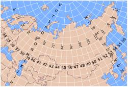
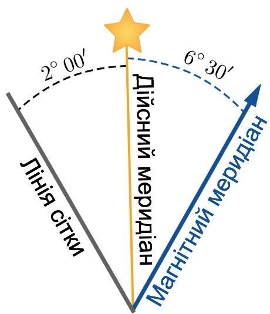

#Топографічна карта

<i>Рисунок 3.4.1:  Створення топографічної карти</i>

 

<i>Автор зображення:</i> Hellerick

Означення

<b>Топографiчна карта</b> — це загальногеографiчна багатоаркушева (27000 листiв) карта великого масштабу (1 : 200000 i бiльше).

 

<i>Автор зображення:</i> Hellerick

Спотворення тут практично відсутні, а об’єкти місцевості передані досить детально. В основі топографічних карт лежить так звана міжнародна мільйонна карта світу — оглядово-топографічна карта всього земного суходолу, складена в масштабі $1: 1 000 000$. Під час створення такої карти застосували рівнокутну циліндричну проекцію, яка дає надзвичайно малі спотворення форм і розмірів зображуваних об’єктів.

Аркуш однієї мільйонної карти отримують шляхом розграфлення земної кулі меридіанами на $6$-градусні колони (зони) і паралелями на $4$-градусні ряди. Отже, кожен аркуш карти масштабу $1 : 1000 000$ має вигляд трапеції розміром $4^{\circ}$ за широтою і $6^{\circ}$ за довготою.

<i>Рисунок 3.4.1:  Фрагмент топографiчної карти</i>

Ряди і колони позначають відповідно латинськими буквами та арабськими числами. 

Наприклад

Аркуш мільйонної карти, на якому зображено Київ, матиме номенклатуру М-36. Україна та цій карті займає 34, 35, 36 колони та 4, 5, 6, 7 зони.

Взагалі у карті міститься 60 колон. Всі аркуші топографічних карт мають рамку у вигляді трапеції. Верхньою (північною) і нижньою (південною) сторонами рамки є паралелі, а бічними (західною і східною) – меридіани. На вершинах кутів рамки підписані значення цих паралелей і меридіанів. Умовні позначення на топографічній карті збігаються з умовними позначеннями на плані. Рельєф на топографічній карті передають горизонталі, які позначають абсолютну висоту. На
топографічній карті також потрібно вміти визначати дійсний азимут.

<b>Дійсний азимут $=$ Магнітний азимут $+$ Mагнітне схилення</b>

Означення

<b>Дiйсний азимут</b> — кут мiж пiвнiчним напрямком географiчного (дiйсного) меридiана i напрямком на певну точку. Його вiдлiчують за ходом годинникової
стрiлки.

Означення

<b>Магнiтний азимут</b> — горизонтальний кут, який вiдлiчується за годинниковою
стрiлкою вiд пiвнiчного напряму магнiтного меридiану точки спостереження до
заданого напряму вiд $0^{\circ}$ до $360^{\circ}$. 
<b>Магнiтне схилення</b> — кут мiж дiйсним меридiаном i магнiтним меридiаном.

Означення

<b>Дiйсний меридiан</b> — це географiчний меридiан, який з’єднує полюси й показує
напрямок пiвнiч-пiвдень. 
<b>Магнiтний меридiан</b> — меридiан, що з’єднує магнiтнi полюси. Магнiтнi та географiчнi полюси не збігаються.

<i>Рисунок 3.4.2:  Дійсний меридіан</i>

<quiz correctLabel="correct" incorrectLabel="incorrect" checkLabel="check"> 
    <question text="">
        
Яка карта лежить в основі топографічних карт?

        <answer>фізична карта світу</answer>
        <answer>мільярдна карта світу</answer>
        <answer correct>міжнародна мільйонна карта світу</answer>
    <explanation>
        Міжнародна мільйонна карта світу — оглядово-топографічна карта всього земного суходолу, складена в масштабі 1:1000000 та у рівнокутній циліндричній проекції.
    </explanation>
    </question>
        <question text="">
        
Що таке дійсний азимут?

        <answer correct>кут мiж пiвнiчним напрямком географiчного (дiйсного) меридiана i напрямком на певну точку</answer>
        <answer>кут мiж дiйсним меридiаном i магнiтним меридiаном</answer>
        <answer>горизонтальний кут, який вiдлiчується за годинниковою стрiлкою вiд пiвнiчного напряму магнiтного меридiану точки спостереження до заданого напряму вiд 0° до 360°</answer>
    </question>
</quiz>
