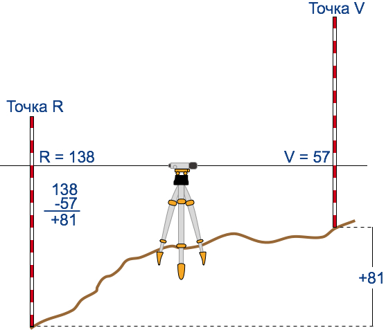

# Вiдносна висота

Визначення

<b>Вiдносна висота</b> — це перевищення однiєї точки земної поверхнi над iншою.

На картах з масштабами $$1 : 500 000$$ і $$1 : 1 000 000$$ для зображення нерівностей земної поверхні застосовують спосіб пошарового забарвлення. Він полягає у фарбуванні глибинних і висотних шарів відповідно до шкали: від темно-синього до блакитного, від темно-зеленого до світло-зеленого і далі від світло-коричневого до темно-коричневого за принципом чим глибше і вище, тим темніший колір. Шкала глибин і висот є на кожній карті. На місцевості відносну висоту визначають за допомогою нівеліра, а процес вимірювання називається нівелюванням.

<i>Рисунок 3.2.1:  Нівелір</i>

<i>Рисунок 3.2.2:  Нівелювання</i>

<quiz correctLabel="correct" incorrectLabel="incorrect" checkLabel="check"> 
    <question text="">
        
Яку назву має процес вимірювання відносної висоти?

        <answer>реперування</answer>
        <answer correct>нівелювання</answer>
        <answer>геодезування</answer>
        <answer>футштокування</answer>
    </question>
</quiz>
