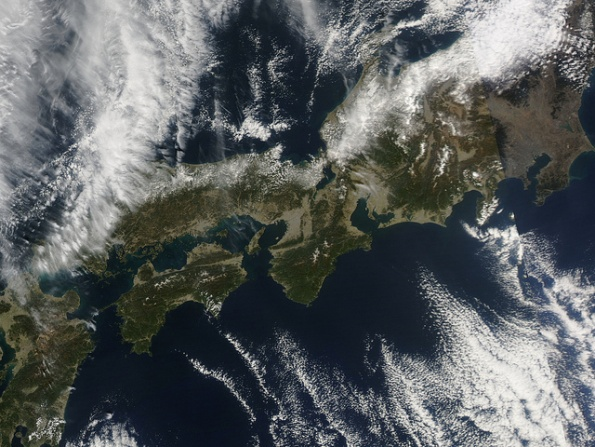

Географія як наука
==================

Земля з повітря
---------------

У наш час є багато способів зображення поверхні Землі на площині. 

Одні з найсучасніших – аерофотознімок (фото з літака)

і космічний знімок (фото з супутника).

Аерофотознімки можуть бути планові (знімають перпендикулярно до поверхні) чи перспективні (вісь знімання нахилена під певним кутом).
Зображена на них місцевість знята з невеликої висоти, тому зображення досить детальне. 

Космічний знімок – це фотографія ділянки Землі чи
іншого небесного тіла, зроблена з космічного літального апарата
(супутника, МКС тощо). 

Прикладка

Завдяки космічному фотографуванню встановлено, що
форма нашої планети — так званий <b>земний геоїд</b>, тобто неідеальна куля, приплюснута з полюсів.

