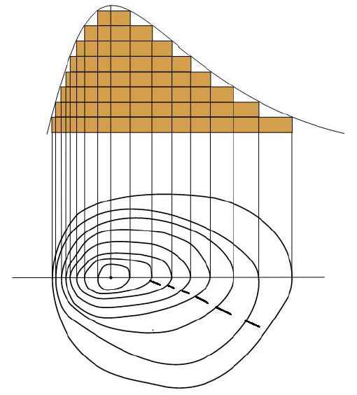
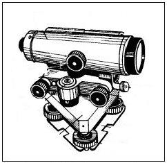
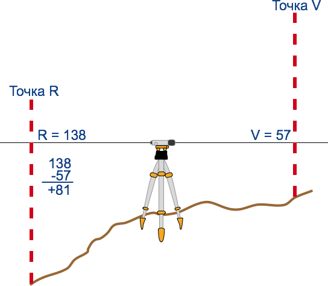

Зображення нерівностей земної поверхні на плані та карті
========================================================

Означення

<b>Рельєф</b> — це всi нерiвностi земної поверхнi.

На плані та карті рельєф передають за допомогою горизонталей або пошарового забарвлення.

Означення

<b>Горизонталi (iзогiпси)</b> – лiнiї на планi або картi, що з’єднують точки мiсцевостi з однаковою абсолютною висотою вiдносно рiвня Свiтового океану.

Горизонталі на карті проводять через певні проміжки по висоті, наприклад через 5, 10 або 20 м.

Означення

<b>Бергштрихи</b> – короткi риски, якi вiльним кiнцем указують напрямок зниження схилу.

Якщо горизонталі розташовані близько, то схил крутий, якщо на більшій відстані, то – пологий.

Існує два види висоти: *абсолютна* і *відносна*.

Означення

<b>Абсолютна висота</b> – це висота мiсцевостi, визначена вiд рiвня Балтiйського моря (за початок вiдлiку висот на Землi прийнято рiвень Балтiйського моря (<b>Кронштадтського футштока</b>)).

<i>Рисунок 3.2.1:  Горизонталi та берштрихи</i>

Абсолютна висота точок, розташованих вище рівня моря, – додатна, а нижче – від’ємна. Так, вище розташовані гори суходолу, нижче – окремі
низовини. 

Наприклад

Абсолютна додатна висота найвищих гір світу
Гімалаїв дорівнює 8848 м над рівнем моря, а абсолютна від’ємна висота – це рівень Мертвого моря (-395 м). 

 

На планах та топографічних картах
абсолютна висота визначається за горизонталями. Абсолютні висоти вершин
горбів або гір показуються на планах і картах цифрою з крапкою. На
місцевості визначити абсолютну висоту можна за репером – геодезичним
знаком, що вказує висоту над рівнем моря даної точки земної поверхні. За
планом або топографічною картою визначається як різниця абсолютних висот
двох точок. На місцевості відносну висоту визначають за допомогою
нівеліра, а процес вимірювання називається нівелюванням. 
 

Означення

<b>Вiдносна висота</b> — це перевищення однiєї точки земної поверхнi над iншою.

На картах з масштабами $1 : 500 000$ і $1 : 1 000 000$ для зображення
нерівностей земної поверхні застосовують спосіб пошарового забарвлення.
Він полягає у фарбуванні глибинних і висотних шарів відповідно до шкали:
від темно-синього до блакитного, від темно-зеленого до світло-зеленого і
далі від світло-коричневого до темно-коричневого за принципом, чим
глибше і чим вище, тим темніший колір. Шкала глибин і висот є на кожній
карті.

<i>Рисунок 3.2.1:  Нівелір</i>

<i>Рисунок 3.2.2:  Нівелювання</i>

