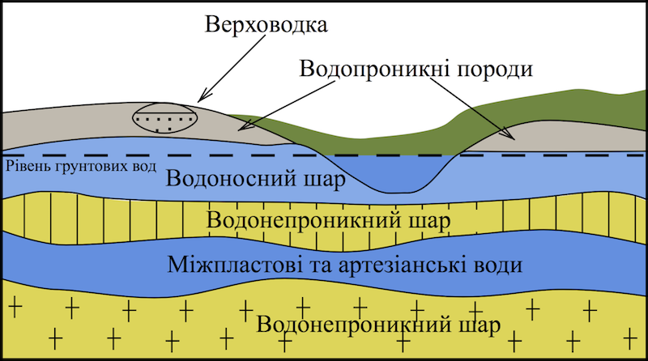

# Болота та штучнi водойми

Болота та штучні водойми
========================

Означення

<b>Болото</b> — надмiрно зволожена дiлянка суходолу зi своєрiдною рослиннiстю та шаром торфу не менш нiж 30 см.

Займають 5% суходолу. Для утворення болота необхідно багато опадів,
близьке розташування підземних вод, плоский рельєф, близьке залягання
водонепроникного шару порід.

**За умовами живлення:**

-   **Низинні** — живляться ґрунтовими водами.

-   **Верхові** — живляться атмосферними опадами.

-   **Перехідні** — мають мішане живлення, тобто як ґрунтовими водами,
    так і атмосферними опадами.

![image](

Рис. 6.8 Види підземних вод

**Роль у природі:**

-   Зволожують повітря навколишньої території, пом’якшують клімат.

-   Є місцем проживання багатьох видів тварин і цінних видів рослин.

-   Є місцем накопичення торфу, який використовують як добриво, паливо
    та хімічну сировину.

-   Після осушення мають високу родючість.

-   Регулюють стік поверхневих вод.

Означення

<b>Штучнi водойми</b> – водойми, створенi людиною.

<b>Водосховища</b> — великi штучнi водойми, створенi для накопичення i зберiгання води. Цю воду людина використовує для вироблення електроенергiї, зрошування, задоволення питних потреб тощо.

<b>Канали</b> — штучнi рiчки. Створюють їх для судноплавства, осушення i зрошування земель.

<b>Ставки</b> — створюють у ярах або спецiальних поглибленнях i використовують для зрошення садiв, городiв, догляду за тваринами, розведення риби, птахiв.

