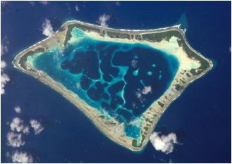

Частини суходолу
================

Означення

Материки — найбiльшi частини суходолу, з усiх бокiв оточенi океанами й морями: Євразiя, Африка, Пiвнiчна Америка, Пiвденна Америка, Антарктида,
Австралiя.

Означення

Пiвострiв — дiлянка суходолу, iз трьох бокiв оточена водою, а з четвертого
з’єднана з масивом суходолу. Наприклад, Аравiйський пiвострiв, Iндостан.

Означення

Острiв — порiвняно невелика дiлянка суходолу, з усiх бокiв оточена водами
океану або моря. Наприклад, острiв Гренландiя, Магадоскар тощо.

**Острови за походженням:**

-   **Материкові** – частини материка, що відділилися внаслідок рухів
    земної кори (Ґренландія, Мадаґаскар).

-   **Вулканічні** – утворилися внаслідок виверження вулканів на дні
    океану (Курильські, Гавайські острови, Ісландія).

-   **Коралові** – створені вапняковими скелетами коралових поліпів, що
    живуть у тропічних частинах океанів (Великий Бар’єрний риф).

Означення

Архiпелаг — група островiв, якi лежать на порiвняно невеликих вiдстанях один вiд одного.

Означення

Атол — кораловий острiв, який найчастiше має форму розiрваного або суцiльного кiльця, що оточує неглибоку (до 100 м) лагуну.

Архіпелагами є Гавайські острови, Британські острови, Зондські острови,
острови Нова Зеландія тощо.

