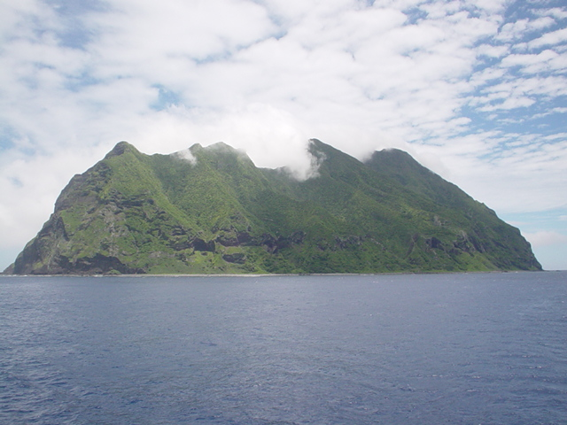
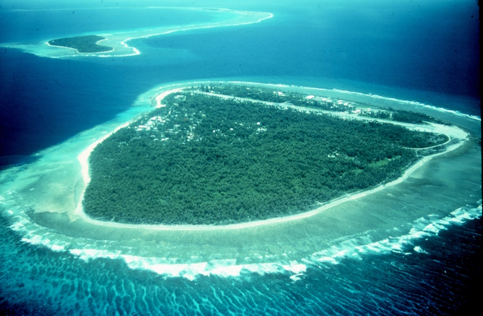
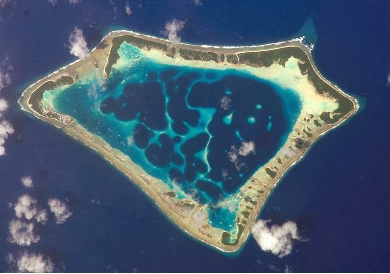
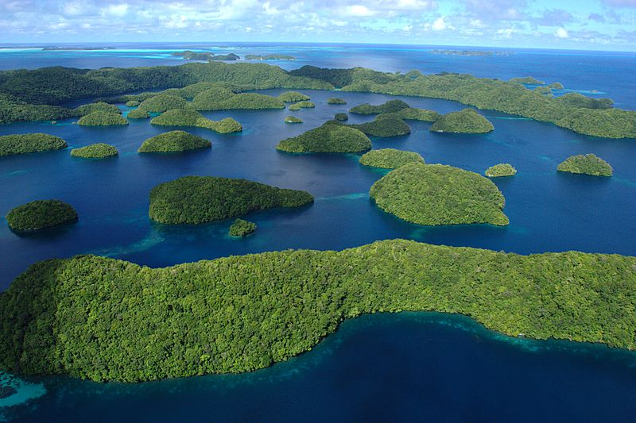

Частини суходолу
================

Визначення

<b>Материки</b> — найбiльшi частини суходолу, з усiх бокiв оточенi океанами й морями: Євразiя, Африка, Пiвнiчна Америка, Пiвденна Америка, Антарктида, Австралiя.

<b>Пiвострiв</b> — дiлянка суходолу, iз трьох бокiв оточена водою, а з четвертого з’єднана з масивом суходолу. Наприклад, Аравiйський пiвострiв, Iндостан.

<b>Острiв</b> — порiвняно невелика дiлянка суходолу, з усiх бокiв оточена водами океану або моря. Наприклад, острiв Гренландiя, Магадоскар тощо.

**Острови за походженням:**
<ul>
<li>Материкові – частини материка, що відділилися внаслідок рухів земної кори (Ґренландія, Мадаґаскар).</li>
<li>Вулканічні – утворилися внаслідок виверження вулканів на дні океану (Курильські, Гавайські острови, Ісландія).</li>
</ul>

<ul>
<li>Коралові – створені вапняковими скелетами коралових поліпів, що живуть у тропічних частинах океанів (Великий Бар’єрний риф).</li>
</ul>

Визначення

<b>Атол</b> — кораловий острiв, який найчастiше має форму розiрваного або суцiльного кiльця, що оточує неглибоку (до 100 м) лагуну.

Означення

<b>Архiпелаг</b> — група островiв, якi лежать на порiвняно невеликих вiдстанях один вiд одного.

Архіпелагами є Гавайські острови, Британські острови, Зондські острови,
острови Нова Зеландія тощо.

<iframe align="center" width="560" height="315" src="https://www.youtube.com/embed/IUoEgKS-DE0" frameborder="0" allowfullscreen></iframe>

<quiz>
<question>

Який з островів не є вулканічним?

<answer>Курильські острови</answer>
<answer>Гавайські острови</answer>
<answer correct>Гренландія</answer>
<answer>Ісландія</answer>
</question>
</quiz>