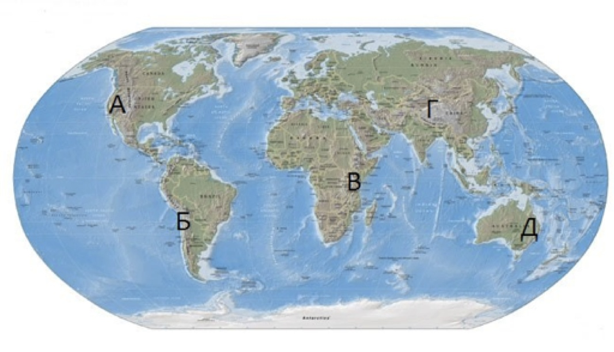

# Додаток. Основнi гори свiту

| Назва | Найвища точка, м | Мiсцезнаходження |
| -- | ---- | -- |
| Гімалаї | Джомолунґма (Еверест) (8848) | Азія |
| Каракорум | Чогори (8611) | Азія |
| Памір | Пік Комунізму (7495) | Азія |
| Тянь-Шань | Пік Перемоги (7439) | Азія |
| Анди | Аконкаґуа (6960) | Південна Америка |
| Кордильєри | Мак-Кінлі (6193) | Північна Америка |
| Кіліманджаро | Кіліманджаро (5895) | Африка |
| Кавказ | Ельбрус (5642) | Азія |
| Альпи | Монблан (4807) | Європа |
| Масив Вінсон | Пік Вінсон (4892) | Антарктида |
| Австралійські Альпи | Косцюшко (2228) | Австралія |
| Карпати | Пік Герлаховський (2655), в Україні – Говерла (2061) | Європа |
 | Кримські гори | Роман-Кош (1545), Ай-Петрі (1234) | Європа |
 
 

<quiz>
<question>

Установіть відповідність між назвами географічних об’єктів, та буквами, якими їх позначено на картосхемі. 
Анди

<answer>А</answer>
<answer correct>Б</answer>
<answer>В</answer>
<answer>Г</answer>
<answer>Д</answer>
</question>
<question>

Великий Вододільний хребет

<answer>А</answer>
<answer>Б</answer>
<answer>В</answer>
<answer>Г</answer>
<answer correct>Д</answer>
</question>
<question>

Гімалаї

<answer>А</answer>
<answer>Б</answer>
<answer>В</answer>
<answer correct>Г</answer>
<answer>Д</answer>
</question>
<question>

Кордильєри

<answer correct>А</answer>
<answer>Б</answer>
<answer>В</answer>
<answer>Г</answer>
<answer>Д</answer>
</question>
</quiz>
