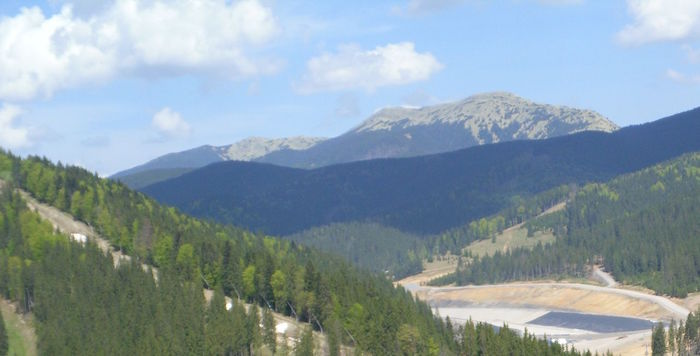

# Гори

Визначення

<b>Гори</b> — дiлянки земної поверхнi, що високо пiдiймаються над прилеглими рiвнинами та мають сильно розчленований рельєф.

<b>Гiрська країна</b> — велика територiя з гiрськими рельєфами й гострими вершинами.

<b>Гiрський хребет</b> — лiнiйно витягнута форма рельєфу, обмежена схилами, що розходяться в протилежнi боки.

<b>Гребiнь</b> — найвища частина гiрського хребта.

<b>Перевали</b> — зниженi мiсця гiрських хребтiв, якi сполучають долини, що лежать з обох бокiв вiд хребта.

<iframe align="center" width="560" height="315" src="https://www.youtube.com/embed/YGjx_hXMiWc" frameborder="0" allowfullscreen></iframe>

Горам у тектонічній структурі відповідають області складчастості.

**За висотою** гори поділяють на:

-   низькі (до 1000 м): Урал, Кримські гори

-   середні (1000—2000 м): Карпати, Скандинавські гори

-   високі (понад 2000 м): Гімалаї, Анди.

Висота гір залежить від виду гірських порід, які їх складають, і швидкості піднімання (зростання гір). Так гори, складені нестійкими породами (піщаник, вапняк та інші), швидко руйнуються і, незважаючи та їхній «молодий вік», мають окремі вершини і є відносно невисокими. <u>Наприклад,</u> Карпати – це молоді гори альпійської складчастості, але за висотою вони середні.

**За віком** гори поділяються на:

-   молоді (процес горотворення ще не завершений, молодші за 60 млн. років): *Альпи, Памір*

-   старі (вік утворення перевищує 60 млн. років): *Урал, Скандинавські гори*

Причиною різноманітності гір Землі є також їхнє походження.

Складчасті гори сформувалися на рухомих ділянках земної кори, найчастіше на краях літосферних плит, коли земна кора стискалася, а гірські породи зминалися у складки. За віком складчасті гори молоді, вони утворилися в нашу (Кайнозойську) еру. <u>Наприклад:</u> Гімалаї, Кордильєри, Кавказькі, Кримські гори, Карпати.

Складчасто-брилові (відродженні) гори формуються, коли на місці знаходження старих гір знову починаються процеси горотворення. Вони мають вирівняні вершинні поверхні, як у давніх гір, але круті схили і значну висоту, як у молодих гір. Такі гори є давніми за віком. <u>Наприклад:</u> Уральські гори, Аппалачі, Тянь-Шань.

Вулканічні гори виникають унаслідок вулканічних вивержень. Вулканічні гори часто мають характерну конусоподібну вершину. <u>Наприклад:</u> Ельбрус, Ключевська Сопка, Фудзіяма.

<quiz>
<question>

Укажіть назву молодих гір.

<answer>Скандинавські гори</answer>
<answer correct>Карпати</answer>
<answer>Аппалачі</answer>
<answer>Урал</answer>
</question>
</quiz>