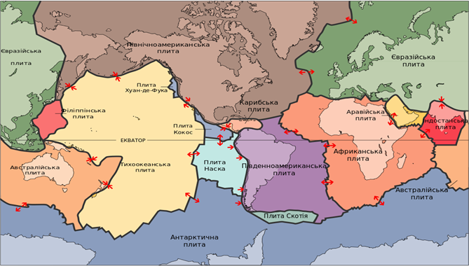

# Літосфера та літосферні плити

Визначення

<b>Лiтосфера</b> — верхня тверда оболонка Землi, що включає земну кору i верхню частину мантiї.

<b>Лiтосфернi плити</b> — величезнi блоки завтовшки до 100 км, з яких складається земна кора разом iз шаром верхньої мантiї.

Межі між літосферними плитами проходять по глибоких розломах у земній корі. Найбільші плити – *Євразійська*, *Африканська*, *Північноамериканська*, *Південноамериканська*, *Індо-Австралійська*, *Антарктична*, *Тихоокеанська*, *Аравійська*. Вони складаються як з материкової, так і океанічної кори. Літосферні плити повільно, але безперервно переміщуються в горизонтальному напрямку, адже земна кора легша від мантії, вона наче «плаває» на астеносфері.

<quiz>
<question>

Укажіть назву літосферної плити, навколо якої утворилася сейсмічна зона «вогняне кільце».

<answer>Кокос</answer>
<answer>Індо-Австралійська</answer>
<answer>Карибська</answer>
<answer correct>Тихоокеанська</answer>
</question>
</quiz>
