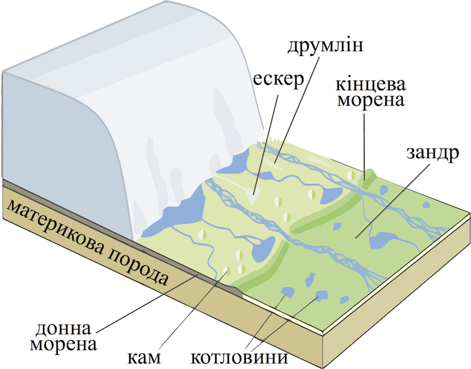

Льодовики та багаторічна мерзлота
=================================

Визначення

<b>Льодовики</b> — природнi рухомi нагромадження льоду на земнiй поверхнi.

Утворюються з твердих атмосферних опадів у районах із низькими температурами повітря, коли снігу випадає більше, ніж може розтанути. Займають 11% площі суходолу. У льодовиках сконцентрована найбільша кількість чистої прісної води на Землі (70%). Вивченням льодовиків займається наука *гляціологія*. Розрізняють гірське (у Гімалаях, Альпах та інших високих горах) і покривне (на рівнинах) зледеніння. До найбільших покривних льодовиків належить льодовик Антарктиди. Від центру цього континенту льодовик сповзає до морського узбережжя. Тут від нього відколюються величезні брили і, потрапляючи в океан, стають плаваючими крижаними горами – айсбергами.

Означення

<b>Снiгова лiнiя</b> — умовна межа, вище якої температура повiтря вiд’ємна i снiгу випадає бiльше, нiж може розтанути.

Висота розташування снігової лінії залежить від кліматичних особливостей місцевості. Так, в горах поблизу екватора снігова лінія перебуває на висоті 4,5-5 тис. метрів. В арктичних і антарктичних широтах завдяки холодному клімату вона опускається майже до рівня моря.

Відступаючий льодовик та форми рельєфу, створені ним

Означення

<b>Робота льодовикiв</b> — руйнування, перенесення i накопичення гiрських порiд.

Руйнуючи гірські породи, льодовик разом з талими водами переносить на певну відстань їхні частки, розміром від піску й пилу до величезних валунів. З цих наносів, під час танення льодовика, утворюються морени, ози, ками.

Льодовики формують кари (льодовикові ложа) – заглиблення, схожі на великі крісла; цирки – чашоподібні заглиблення; ози – довгі, вузькі піщані вали; ками – піщані горби та морени – скупчення переміщених та відкладених льодовиком уламків.

Означення

<b>Багаторiчна мерзлота</b> — шари мерзлих гiрських порiд у надрах Землi, якi не розмерзаються протягом року.

<quiz>
<question>

Яку назву мають чашоподібні заглиблення, створені льодовиками?

<answer>кари</answer> 
<answer>ози</answer> 
<answer>ками</answer>
<answer correct>цирки</answer>
</question>
</quiz>
