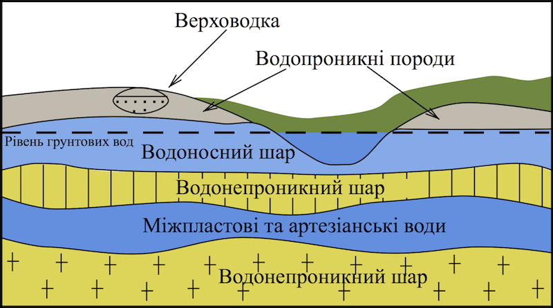

# Пiдземнi води

Означення

<b>Пiдземнi води</b> — це води, якi залягають в трiщинах та пустотах земної кори в рiдкому, твердому та газоподiбному станi.

На підземні води припадає близько 23% всієї прісної води на Землі. Під дією підземних вод утворюються карстові печери. Для їх утворення необхідна достатня кількість атмосферних опадів і залягання водопроникних шарів гірських порід над водотривкими.

Водопроникні гірські породи — породи, які легко пропускають воду, наприклад пісок і гравій.

Водотривкі породи, як-от глина або граніт, навпаки, не пропускають крізь себе воду.

<i>Рис. 6.10 Види підземних вод</i>

**За умовами залягання:**
<ul>
<li>Верховодка — найближчі до земної поверхні підземні води, що не мають суцільного поширення.</li>
<li>Ґрунтові — залягають у першому від поверхні водотривкому шарі.</li>
<li>Міжпластові — залягають між двома водотривкими пластами.</li>
</ul>

**За хімічним складом:**
<ul>
<li>Прісні — містять незначну кількість домішок та розчинених мікроелементів.</li>
<li>Мінералізовані — містять багато солей, мікроелементів.</li>
</ul>

Означення

<b>Джерело</b> — природний, самочинний сконцентрований вихiд на земну поверхню пiдземних вод.

<b>Гейзер</b> — джерело, що перiодично фонтанує гарячою водою та парою.

<b>Артезiанськi води</b> — пiдземнi води, розташованi у водоносних шарах мiж водонепроникними шарами пiд тиском.

<b>Термальнi води</b> — пiдземнi води, що мають пiдвищену температуру (вище 20ºC)

<quiz>
<question>

Скільки відсотків запасів прісної води на Землі припадає на підземні води?

<answer>13%</answer>
<answer>11%</answer>
<answer>23%</answer>
<answer>25%</answer>
</question>
<question>

Які підземні води називають артезіанськими?

<answer>Найближчі до земної поверхні підземні води, що не мають суцільного поширення</answer>
<answer>Розташованi у водоносних шарах мiж водонепроникними шарами пiд тиском</answer>
<answer>Залягають у першому від поверхні водотривкому шарі</answer>
<answer>Мають пiдвищену температуру (вище 20ºC) </answer>
</question>
<quiz>
