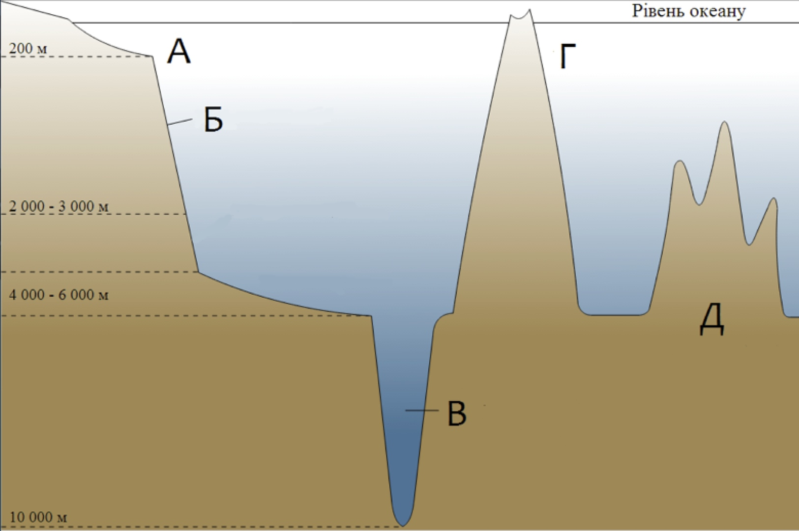

Рельєф дна Свiтового океану
===========================

На материковій обмілині (шельфі) та материковому схилі продовжуються рівнини і гори суходолу. Для них характерний материковий тип земної кори (до глибини 3000-4000 м).

Ложе океану розташоване глибше, за межами підводної окраїни материка, де поширений океанічний тип земної кори. Рельєф тут здебільшого горбисто-рівнинний, однак трапляються й окремі гори вулканічного походження.

Часто підводну окраїну материка і ложе океану розділяє перехідна зона. Вона розташована у місцях сходження літосферних плит і має перехідний (від материкового до океанічного) тип земної кори та дуже складний рельєф. Тут позмінно чергуються улоговини окраїнних морів, підводні хребти та найглибші частини Світового океану — глибоководні жолоби. В районі улоговин окраїнних морів і глибоководних жолобів перебувають епіцентри землетрусів. Вершини підводних хребтів можуть здійматися над поверхнею води, утворюючи острівні дуги. Саме тут найбільше діючих вулканів. Найактивніші з них розташовані на морському дні.

Визначення

<b>Рифти</b> — розломи дна океану завглибшки кiлька кiлометрiв, якi утворюються внаслiдок розходження лiтосферних плит.

По них з мантії рухається вгору розігріта речовина, що нагромаджується та застигає на дні океану, утворюючи серединно-океанічні хребти.

Означення

<b>Глибоководнi жолоби</b> — вiдносно вузькi западини дна океану з глибинами до 11 км (Марiанський жолоб).

<iframe align="center" width="560" height="315" src="https://www.youtube.com/embed/USy5XJhx5oM" frameborder="0" allowfullscreen></iframe>

<quiz>
<question>

Установіть відповідність між об’єктами, позначеними на схемі буквами, і  їх назвами. 
океанічний жолоб

<answer>А</answer>
<answer>Б</answer>
<answer correct>В</answer>
<answer>Г</answer>
<answer>Д</answer>
</question>
<question>

шельф 

<answer correct>А</answer>
<answer>Б</answer>
<answer>В</answer>
<answer>Г</answer>
<answer>Д</answer>
</question>
<question>

підводний хребет 

<answer>А</answer>
<answer>Б</answer>
<answer>В</answer>
<answer>Г</answer>
<answer correct>Д</answer>
</question>
<question>
материковий схил

<answer>А</answer>
<answer correct>Б</answer>
<answer>В</answer>
<answer>Г</answer>
<answer>Д</answer>
</question>
</quiz>