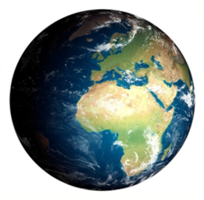

Розміри Землі
=============

Площа нашої планети 510 065 700 км$^{2}$. З них 70,8% займають води океанів, а 29,2% — суша. Форма нашої планети – геоїд, тому екваторіальний та полярний радіус будуть різними. Екваторіальний радіус дорівнює 6378 км, а полярний радіус – 6356 км. Отже, середній радіус складає 6371 км, а полюсне стиснення дорівнює 22 км.

<quiz>
<question>

Який шар гірських порід відсутній у океанічному типі земної кори?

<answer>Осадовий</answer> 
<answer correct> Гранітний</answer>  
<answer> Базальтовий</answer>
</question>

У результаті яких процесів утворюються магматичні гірські породи?

<answer>випадіння в осад речовин, розчинених у водах океанів</answer>
<answer>нагромадження решток відмерлих рослин та тварин</answer>
<answer>перетворення гірських порід у  глибинних зонах земної кори</answer>
<answer correct>застигання й  кристалізації магми</answer> 
</question>
</quiz>
