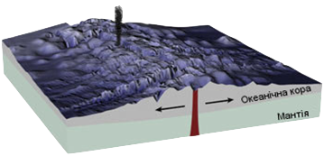
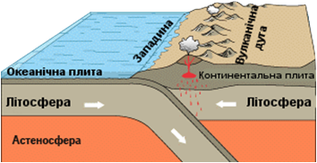

Рухи земної кори
================

Головна причина рухів земної кори — це переміщення речовини мантії,
зумовлені внутрішньою енергією планети, яка накопичується, тому що
глибинні шари Землі мають дуже велику температуру та перебувають під
величезним тиском шарів, що лежать вище. Явища, які викликані
внутрішніми силами, називають внутрішніми процесами. З ними пов’язані
різноманітні тектонічні рухи, землетруси, вулканізми.

<table>
  <tr>
    <th colspan="2">Горизонтальнi</th>
    <th>Вертикальнi</th>
  </tr>
  <tr>
    <td width="35%">Розходження лiтосферних
плит призводить до утворення серединно-океанiчних
хребтiв (в океанах), розломiв i трiщин (на материках)</td>
    <td width="50%"></td>
    <td width="15%" rowspan="3">Пiдняття та опускання зi швидкiстю
кiлька сантиметрiв на рiк</td>
  </tr>
  <tr>
    <td>Зiткнення материкових
плит призводить до утворення складчастих гiр</td>
    <td></td>
  </tr>
  <tr>
    <td>Зiткнення материкової
та океанiчної плит призводить до утворення глибоководних жолобiв та материкових гiр</td>
    <td></td>
  </tr>
</table>

Означення

<b>Тектонiка</b> — наука, що вивчає особливостi будови земної кори та рухи лiтосферних плит.

<b>Тектонiчнi структури</b> — це рiзнi за будовою i вiком дiлянки лiтосфери.

<b>Платформи</b> — великi, стiйкi, вирiвнянi дiлянки земної кори.

Платформи є основою літосферних плит. Платформи складаються з двох
ярусів: **фундаменту** (твердий, утворений переважно магматичними
породами) і **осадового чохла** (складається з осадових порід). Породи
фундаменту можуть виходити з-під осадових пухких порід на поверхню,
утворюючи ділянки, які називають *щитами*, а ділянки, вкриті чохлом,
називають *плитами* (не плутати з літосферними).

Означення

<b>Пояс складчастостi</b> (сейсмiчний пояс) — рухомi дiлянки земної кори, якi розташованi на межi лiтосферних плит.

Це найбільш неспокійні рухомі ділянки планети — в їхніх межах
відбуваються процеси активного вулканізму, землетруси.
